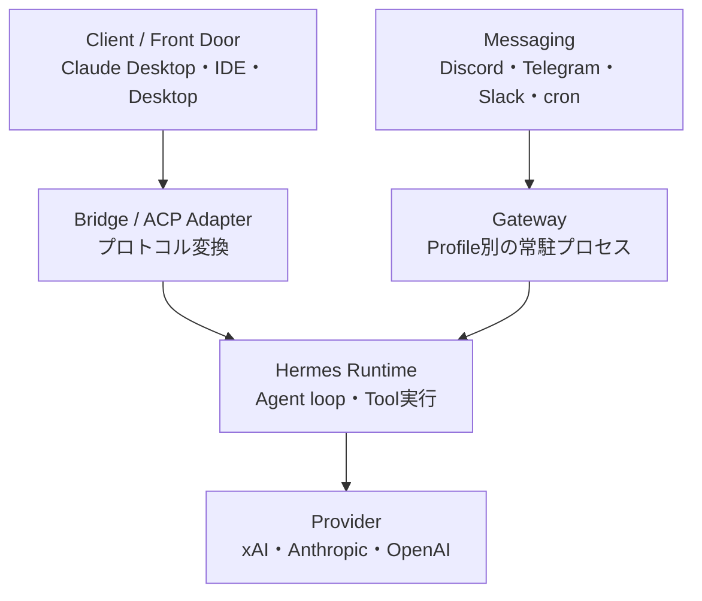
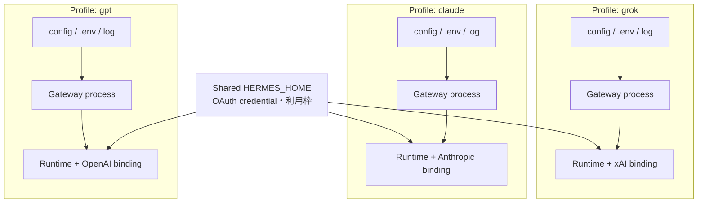
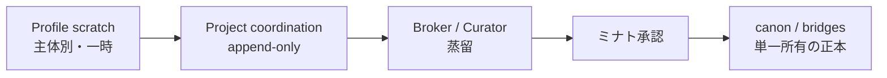

# Hermes Agent 最新アーキテクチャ設計書

本書は、REX_AI 環境における Hermes Agent の現行構成を、新しく参加する開発者が短時間で理解し、安全に運用・拡張できるよう整理したものである。

対象は主に次の設計変更である。

- Gateway、Runtime、Bridge、Proxy の責務分離
- `1 Profile = 1 常駐エージェント` によるプロセス分離
- OAuth credential と provider binding の分離
- `hermes -p <profile>` による都度の Profile 固定
- Runtime Plane と Knowledge Plane の分離
- coordination から Broker、ミナト承認、canon/`bridges/` へ至る昇格経路

> 結論：現行標準は「中央 Proxy に全クライアントを集約する構成」ではない。**Profile ごとに Gateway と Runtime の可変状態を分離し、すべての起動・診断で `-p <profile>` を明示する構成**である。OAuth credential や利用枠は一部共有されるため、Profile 分離はアカウント分離を意味しない。

## 1. 設計要約と全体像

### 1.1 二つの独立した設計軸

Hermes Agent 全体は、次の二軸に分けて理解する。

| 軸 | 目的 | 主な構成要素 | 現在地 |
|---|---|---|---|
| **Runtime Plane** | Agent を起動し、Provider と Tool を使って仕事を実行する | Client、Bridge、Gateway、Profile、Runtime、Provider | 複数 Profile/Gateway の並行運用まで実装済み |
| **Knowledge Plane** | 実行中の推論を、共有可能なプロジェクト知識へ安全に昇格する | scratch、coordination、Broker、canon、`bridges/` | 所有権ルールは確定。自動蒸留ループは整備途上 |

したがって、「複数の Bot/Agent が同時に動く」ことと、「複数 Agent が自律的に同じ知識を更新する」ことは同義ではない。前者は現行運用、後者は単一所有と承認を伴う次段階である。

### 1.2 Runtime Plane の全体構成



- IDE/ACP や Claude Desktop/MCP からの要求は、Bridge または公式の ACP 経路を通って Runtime に入る。
- Discord などのメッセージングと cron は、Profile ごとの Gateway が常駐して受ける。
- 実際に agent loop を回し、Tool を呼び、Provider に推論を要求する主体は Hermes Runtime である。
- Gateway は Runtime そのものではなく、Bridge も Runtime ではない。

### 1.3 用語と責務

| 構成要素 | 一言で言うと | 所有するもの | 所有しないもの |
|---|---|---|---|
| **Client / Front Door** | 利用者や別 Agent の入口 | UI、要求、対話セッション | Hermes の provider state |
| **Bridge** | 通路・通訳 | プロトコル変換、引数、stdout/UTF-8 変換 | OAuth credential、provider binding、agent loop |
| **Gateway** | メッセージング＋cron の常駐デーモン | Bot 接続、イベント待受、プロセス寿命 | LLM 本体、共有 canon |
| **Profile** | 1 Agent の物理的な設定境界 | `config.yaml`、`.env`、provider/model binding、Bot token、log | Provider の独立アカウントや独立利用枠 |
| **Runtime** | 実行工場 | agent loop、Tool 実行、Provider 呼出し | プロジェクトの公式知識の最終決定権 |
| **Provider** | 外部推論バックエンド | モデル、認証方式、利用制限 | Hermes の Profile/Gateway 構成 |
| **Proxy** | HTTP/OpenAI互換の中央状態所有者 | 中央化した provider/OAuth state | 現行 Profile 別 Gateway の標準経路 |

`grok_oauth_bridge.py` は、Claude の MCP/stdio 世界と Hermes CLI/Runtime 世界を結ぶカスタム Bridge である。内部で `hermes -p grok -z ...` を同期実行するが、Bridge 自身が Grok を実行するわけではない。Bridge は可能な限り stateless に保つ。

公式 Hermes Desktop/IDE Plugin は、現在の内部資料では ACP 接続を製品化した Client/Adapter 経路として扱う。Messaging を使わない対話では Gateway は必須ではない。

## 2. 分離境界と状態所有

### 2.1 現行の Profile/Gateway 分離

Profile の標準配置は次のとおりである。

```text
%LOCALAPPDATA%\hermes\
├── profiles\
│   ├── grok\
│   │   ├── config.yaml
│   │   ├── .env
│   │   └── logs\gateway.log
│   ├── claude\
│   │   ├── config.yaml
│   │   ├── .env
│   │   └── logs\gateway.log
│   └── gpt\
│       ├── config.yaml
│       ├── .env
│       └── logs\gateway.log
└── <shared provider credential / OAuth store>
```

各 Gateway は、起動時に指定された Profile の `config.yaml` と `.env` を自分のプロセスへ読み込む。これにより provider/model binding、Discord Bot identity、プロセス内の可変状態、ログの出力先が分離される。



### 2.2 なぜ Gateway 分離と `-p` の両方が必要か

二つは異なる問題を解く。

| 分離 | 解決する競合 | 解決しないこと |
|---|---|---|
| **Gateway のプロセス分離** | Bot、セッション、プロセス内可変 state の衝突 | どの Profile/provider 設定を読むか |
| **`-p <profile>` の明示** | Profile config と provider binding の取り違え | 同じ OAuth アカウントの利用枠共有 |

複数 Gateway を起動しても、Profile を固定しなければ global/default state にフォールバックし、provider 選択の上書き、誤接続、拒否が起こり得る。逆に `-p` だけ指定しても、一つの常駐プロセスに複数 Bot の可変 state を持たせれば、プロセス境界は分離されない。

同じ Grok OAuth だけで試験している間は、認証元が共通なので問題が表面化しにくい。Claude、Grok、GPT のように Provider が混在した時点で、Profile ごとの binding 不備が顕在化する。このため、**すべての lifecycle・診断・one-shot コマンドで `-p <profile>` を明示する**。

> `grok` は慣例的な Profile 名であり、xAI Provider そのものではない。`-p grok` が選ぶのは Profile で、その Profile 内に xAI/model binding が保存される。

### 2.3 OAuth credential と provider binding は別物

「ログイン済み」を一つの状態として扱わない。

| 状態 | 意味 | 代表的な障害 |
|---|---|---|
| **OAuth/API credential** | Provider を利用する権利 | 未認証、期限切れ、利用枠超過 |
| **provider/model binding** | Profile がどの Provider/model を呼ぶか | 認証済みなのに空応答、別 Provider、拒否 |

Hermes が正常に動くには両方が必要である。`auth status/list` が正常でも推論できない場合、まず `model` で Profile の binding を確認する。

- xAI SuperGrok の OAuth store と日次枠は `HERMES_HOME` 側で共有される。Grok Profile を増やしても利用枠は増えない。
- Discord Bot token/identity は Profile ごとに分離する。
- Anthropic/Claude、OpenAI/Codex は xAI とは別の credential 系統を使う。credential の取得元が別でも、Profile binding の明示は必要である。
- `.env`、Bot token、OAuth store、API key を Git にコミットしない。設計書やサンプルには実値を記載しない。

### 2.4 単一所有という共通原則

旧構成と現行構成は方式が異なるが、守る原則は同じである。

| 構成 | 可変 state の守り方 | 現在の位置づけ |
|---|---|---|
| **旧：中央 Proxy** | `hermes proxy` が OAuth/provider state を一元所有 | 退役した Grok-UI/ngrok 経路に紐づく旧標準 |
| **現：Profile 分割** | Profile ごとの Gateway/Runtime process が自 state を所有 | 現行標準 |

つまり設計原則は、**可変 state を共有しない。共有が必要なら単一所有者を置く**、である。Proxy を外したことは単一所有を捨てたことではなく、所有単位を「中央一個」から「Profile ごとの一個」へ変更したことを意味する。

### 2.5 Knowledge Plane の所有権

Runtime の分離だけでは、「ある Agent の推測が別 Agent の事実になる」事故を防げない。共有知識は次の昇格経路を通す。



| 層 | 書込主体 | 性質 |
|---|---|---|
| Profile scratch / workspace | 各 Agent | 一時推論。共有事実ではない |
| Project coordination | 各運用 Agent | append-only の作業記録。矛盾を消さず残す |
| Broker/Curator | Broker 役 | coordination を比較・蒸留する |
| `bridges/` / canon | Broker 役のみ | ミナト承認後のプロジェクト一次資料 |
| `REX/`、`UCAR/` | 各主体のみ | 主体固有の経験・解釈。他方は参照のみ |
| 各 Project repo | プロジェクト所有者 | 成果物、仕様、実装記録の正本 |

現在の Broker 役は Claude が担い、将来は専用 broker Profile へ移譲できる。運用 Agent が `bridges/` を直接整備することはない。Discord は Agent 間のメッセージバスにはなり得るが、メッセージ内容を自動的に canon 化する経路ではない。

## 3. 開発者運用と移行ルール

### 3.1 標準起動手順

まず Profile、credential、binding を分けて確認し、one-shot が通ってから Gateway を常駐させる。

```powershell
# 1. Profile 一覧
hermes profile list

# 2. 対象 Profile の credential と provider/model binding を確認
hermes -p grok auth list
hermes -p grok model

# 3. Runtime の smoke test
hermes -p grok -z "State your exact model id." --accept-hooks

# 4. Profile 別 Gateway を起動
hermes -p grok gateway run
hermes -p claude gateway run
hermes -p gpt gateway run
```

設定変更後など、同じ Profile の既存 Gateway を置き換える時だけ `--replace` を使う。

```powershell
hermes -p gpt gateway run --replace
```

詳細ログはコンソールではなく Profile 別ファイルを正本とする。

```text
%LOCALAPPDATA%\hermes\profiles\<profile>\logs\gateway.log
```

### 3.2 入口別の実行フロー

| 入口 | 標準フロー | Gateway | 用途 |
|---|---|---|---|
| Discord/Telegram/Slack/cron | Channel → Profile Gateway → Runtime → Provider | 必須 | 常駐 Bot、定期実行 |
| IDE/公式 ACP Client | Client/ACP → Profile Runtime → Provider | 通常不要 | 対話型の開発作業 |
| Claude Desktop custom MCP | Claude → stdio Bridge → `hermes -p <name> -z` → Runtime | 不要 | 既存 MCP 互換、同期 one-shot |
| HTTP/OpenAI互換 Client | Client → `hermes proxy` → Runtime | 別構成 | 現行標準外。中央 endpoint が必要な場合のみ再設計 |

### 3.3 障害切り分け

| 症状 | 最初に疑う層 | 確認・対処 |
|---|---|---|
| Bot が起動しない／別 Bot と競合 | Gateway/Profile | 起動コマンドの `-p`、Profile 別 token、同一 Profile の二重起動を確認 |
| ログイン済みだが空応答／別モデル | provider binding | `hermes -p <name> model` で再選択し、one-shot smoke test |
| 複数 Grok Agent が同時に制限される | shared OAuth/quota | 同一 SuperGrok 利用枠の共有として扱う。Profile 追加では解消しない |
| Gateway は動くがコンソールに詳細がない | observability | `profiles/<name>/logs/gateway.log` を確認 |
| Claude Desktop Bridge の修正が反映されない | Bridge host process | MCP subprocess を保持する host を完全終了して再起動 |
| 日本語を含む one-shot だけ stdout が空 | Bridge encoding | subprocess を UTF-8、`errors="replace"` で decode |
| Agent 間で「確定事項」が食い違う | Knowledge Plane | coordination の根拠を比較し、Broker→ミナト承認を経て canon を更新 |

### 3.4 退役・互換・未完了の区別

| 項目 | 判定 | 扱い |
|---|---|---|
| Grok-UI → ngrok → Gateway → Proxy 経路 | 退役 | 新規実装の前提にしない |
| `hermes proxy` localhost:8000 中央集約 | 現行標準外 | HTTP/OpenAI互換 endpoint が必要な場合のみ別設計として検討 |
| `grok_oauth_bridge.py` + `hermes -z` | 互換経路 | Claude Desktop/MCP の同期呼出しに限定して維持可能 |
| `hermes login` | 旧コマンド | `hermes auth` 系を使う |
| `~/.hermes` を Profile root とみなす | 誤り／旧前提 | `%LOCALAPPDATA%\hermes\profiles\<name>` を使う |
| `Hermes_Agent/README.md` の「連携準備のみ」 | 初期導入時のスナップショット | 現在の Runtime/Gateway 運用状態の判定には使わない |
| Profile 別 Runtime/Gateway | 実装済み | 現行標準 |
| scratch → coordination → Broker → canon の自動化 | 整備途上 | 所有権ルールを先に守り、段階的に実装する |

### 3.5 新規開発・レビュー時の受入条件

新しい Profile、Provider、Bridge、Bot を追加する変更は、少なくとも次を満たすこと。

- すべての起動・診断コマンドで対象 Profile が明示されている。
- Gateway は Profile ごとに別プロセスで起動される。
- provider credential と provider/model binding を別々に検証できる。
- Profile ごとの config、secret、log の所在が明確である。
- 共有 OAuth/quota と Profile 固有 state の境界が文書化されている。
- Bridge が durable credential や project canon の所有者になっていない。
- Runtime の作業出力を、そのまま `bridges/`/canon に書き込まない。
- project coordination → Broker 蒸留 → ミナト承認の経路を迂回しない。
- secret 実値を repo、設計書、ログ例に残さない。
- 旧 Proxy/Grok-UI 経路を現行標準として復活させていない。

### 3.6 参照した正本

- `Minato33440/Hermes_Agent/docs/Grok_OAuth_Bridge_Architecture.md` — custom Bridge、one-shot、OAuth/binding 障害の実装記録
- `Minato33440/Hermes_Agent/docs/MCP_Commands_Reference.md` — MCP と Hermes 経路の既存運用リファレンス
- `Local orchestration lecture v11.md` — Gateway、Runtime、Profile、Proxy、provider binding の最新内部整理
- `Minato33440/REX_Brain_Vault/AGENTS.md` v2.5（2026-07-15）— 主体別記憶、Broker、`bridges/` 書込権限、昇格経路の正本

資料間に差異がある場合、Runtime Plane は本書と `Local orchestration lecture v11.md` の現行整理を優先し、個別 Bridge 文書はそのコンポーネントの実装履歴として読む。Knowledge Plane の所有権は `REX_Brain_Vault/AGENTS.md` を優先する。

---

本書の更新原則：Runtime の実装事実は Hermes Agent 側の資料を、Knowledge Plane の所有権は `REX_Brain_Vault/AGENTS.md` と各 Project repo を正本とする。両者を一つの可変 state として管理しない。