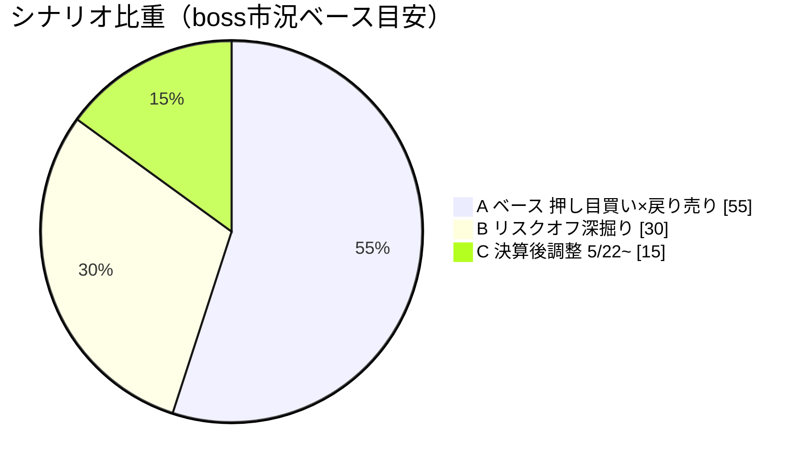
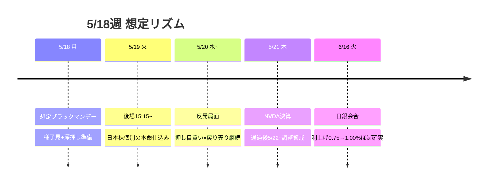

# 📌 CFD戦略ハブ — 5/18週

> [!abstract] 一行サマリー
> 週末にかけ世界的[[債券パニック]]→[[リスクオフ]]進行（[[US10Y]] 4.595で4.4%突破・[[VIX]] 18.43で[[Add risk gate]]閉・[[Gold]]急落=off）。一方[[米中首脳会談]]成功で[[NVDA決算]](5/21)まで「下げたら買い」上目線。**[[ブラックマンデー|月曜ブラックマンデー]]→火曜下押し→水曜以降反発**を想定、[[押し目買い]]（株）× [[戻り売り]]（ドル円）の二刀流。

> [!warning] [[レジーム]] / ゲート（at a glance）
> - 機械[[レジーム]]: **`Neutral`**（gold=off で内部[[リスクオフ]]前傾）
> - [[Add risk gate]]: **閉**（[[VIX]] 18.43 > 18）
> - [[Reduce risk gate]]: **成立中**（[[US10Y]] 4.595 > 4.4%定着）
> - 機械=Neutral / boss=「[[リスクオフ]]・トリプル安」→ *両論併記*

## 🔗 リンク

| 種別 | リンク |
|---|---|
| 📊 **詳細版（全グラフ・銘柄別・トリガー網羅）** | [[CFD_Strategy-2026-5-18.html\|CFD詳細ブリーフ HTML（外部ブラウザ）]] |
| 🧠 Rex戦略データ正本 | [[distilled-gm-2026-5]] |
| 📝 週次一次資料 | [[review]] ・ [[meta]] ・ [[2026-5-15_wk03/note\|note]] |
| ⏪ 前週ハブ | [[CFD戦略-2026-5-11\|wk02 ハブ (5/11週)]] |

## 🎯 今週の要点（3行）

1. **株**：[[ブラックマンデー|月曜深押し]]＝[[押し目買い]]好機。火曜後場(15:15以降)が日本株個別の本命仕込み。[[US100]]は27,989赤丸反発→28,874、上は追わない（[[NVDA決算]] 5/21まで）。
2. **為替**：[[USDJPY]] 158後半売り→157.60→156買い戻しのレンジ往復。[[戻り売り]]優位（[[為替介入]]/[[レートチェック]]警戒）。
3. **ヘッジ**：[[Gold]]急落も保有継続（新規は$3,150–3,200深押し待ち）。[[BTC]] 80,000維持で[[押し目買い]]。

## 📈 クイックビュー

## ⚠️ 監視トリガー（要点のみ／詳細はHTML）

- **JP10Y > 2.9%** → 🔻 株式エクスポージャー一段落とし（最重要）
- [[US10Y]] 4.6–4.7%定着 / [[VIX]] > 22 → 🔻 [[リスクオフ]]加速・落とし
- [[US100]] < 27,989 → 🟠 調整深掘り ／ [[BTC]] < 80,000 → 95,000想定で[[押し目買い]]
- [[日銀利上げ]](6/16 0.75→1.00%) / [[FOMC|FRB]]年内利上げ確率3割 → 決算後調整警戒

---

> [!quote] 注記
> 本ノートは **Obsidian索引（ハブ）**。要点とリンクのみ。全グラフ・銘柄別アクション・ポートフォリオ詳細は [[CFD_Strategy-2026-5-18.html\|HTML詳細版]]。**Rex戦略データ正本は [[distilled-gm-2026-5]]**。データは 2026-5-15_wk03 確定値に忠実（創作なし・両論併記／ボス承認済）。投資助言ではなくGM運用の作戦整理。最終判断はミナト。生成: ClaudeCode / 2026-05-16。
