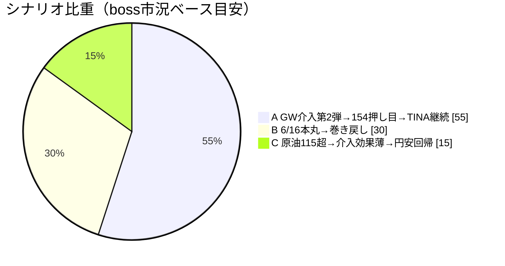
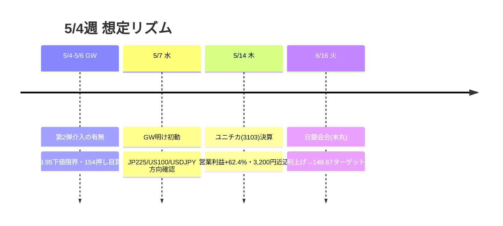

# 📌 CFD戦略ハブ — 5/4週

> [!abstract] 一行サマリー
> 4/28 [[日銀政策金利|BOJ]]ハト派確認（[[VIX]] 16.99 → [[Add risk gate]]<18達成）直後、4/30に[[為替介入]]5.4兆円（160.50→155.55→156.57）が発動。米株は[[FOMC|S&P500]]4月+10%・Nasdaq25,000史上初で5週陽線過熱圏。[[レジーム]]は Gold Bid→Neutral 転換。次の本丸は[[日銀利上げ]](6/16・148.67ターゲット)。GW中([[GW介入|第2弾介入]] 5/4–5/6)の154.00–154.50 [[押し目買い|ドル円押し目ロング]]が最優先アクション。

> [!warning] [[レジーム]] / ゲート（at a glance）
> - 機械[[レジーム]]: **`Neutral`**（gold=range ／ Gold Bidから転換）
> - [[Add risk gate]]: **開**（[[VIX]] 16.99 < 18 達成）※5週陽線過熱で追撃禁止
> - [[Reduce risk gate]]: clear（US100<26,000 / VIX>22 / WTI>110 で発火）

## 🔗 リンク

| 種別 | リンク |
|---|---|
| 📊 詳細版 | [[CFD_Strategy-2026-5-4.html\|CFD詳細ブリーフ HTML（外部ブラウザ）]] |
| 🧠 Rex戦略データ正本 | [[distilled-gm-2026-5]] |
| 📝 週次一次資料 | [[review]] ・ [[meta]] ・ [[2026-5-1_wk01/note\|note]] |
| ⏩ 次週ハブ | [[CFD戦略-2026-5-11\|wk02 ハブ (5/11週)]] |

## 🎯 今週の要点（3行）

1. **為替**：[[GW介入|GW第2弾介入]](5/4–5/6)の153.95–154.50で[[押し目買い|ドル円ロング]]（ストップ153.50・ターゲット157.50–158.00）。介入来たら静観→下げ止まり確認後。
2. **株**：[[US100]]は5週陽線・[[FOMC|4月S&P+10%]]の過熱圏。26,400赤丸まで新規追撃禁止。5/7 GW明けで方向確認。
3. **ヘッジ**：[[Gold]] 4,630 range転換、4,450–4,500打診買い。6/16[[日銀利上げ]]後は円建て下落リスクに留意。

## 📈 クイックビュー

## ⚠️ 監視トリガー（要点のみ／詳細はHTML）

- [[GW介入|第2弾介入]] 153.95割れ → 介入効果限界・[[戻り売り|円安回帰]]リスク
- [[US100]] D1 close < 26,000 / [[VIX]] > 22 / [[WTI]] > 110$ → [[Reduce risk gate]]発火
- 5/7 GW明け [[US100]]・JP225・[[USDJPY]] 初動方向 → 週の方針確定
- [[FOMC]]・CPI・雇用統計 → 利下げ期待変化（原油高インフレ確認）

---

> [!quote] 注記
> 本ノートは **Obsidian索引（ハブ）**。全詳細は [[CFD_Strategy-2026-5-4.html\|HTML詳細版]]、**Rex戦略データ正本は [[distilled-gm-2026-5]]**。データは 2026-5-1_wk01 確定値に忠実（創作なし）。投資助言ではなくGM運用の作戦整理。最終判断はミナト。生成: ClaudeCode / 2026-05-16（遡及作成）。
