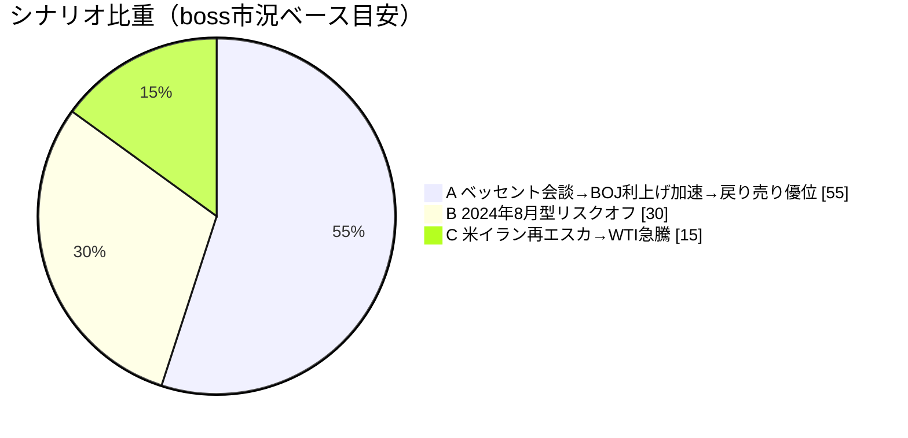
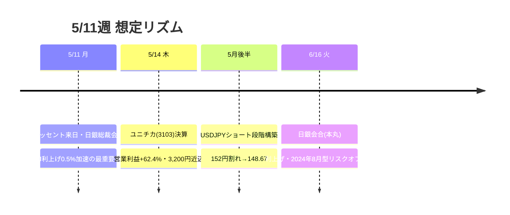

# 📌 CFD戦略ハブ — 5/11週

> [!abstract] 一行サマリー
> GW中の[[GW介入|第2弾介入]]（5月計約4.68兆円・合計10兆円規模）は効果3円に留まり、円安抑制の主軸が[[為替介入]]→[[日銀利上げ]]加速へシフト。5/7 JP225 史上最大+5.58%（[[US100]]+5.5%のGW明けキャッチアップ）で過熱感、[[BTC]] 80,000突破。[[ベッセント来日]]・日銀総裁異例会談（5/11）が最大焦点。[[USDJPY]] 157.25からの[[戻り売り]]が「ボーナスステージ」。

> [!warning] [[レジーム]] / ゲート（at a glance）
> - 機械[[レジーム]]: **`Neutral`**（gold=range ／ wk01継続）
> - [[Add risk gate]]: **開**（[[VIX]] 17.19 < 18 継続）※過熱で追撃禁止
> - [[Reduce risk gate]]: clear（US100<27,500 / VIX>22 / BOJ利上げ加速で日本株崩れ / US10Y>4.4%定着 で発火）

## 🔗 リンク

| 種別 | リンク |
|---|---|
| 📊 詳細版 | [[CFD_Strategy-2026-5-11.html\|CFD詳細ブリーフ HTML（外部ブラウザ）]] |
| 🧠 Rex戦略データ正本 | [[distilled-gm-2026-5]] |
| 📝 週次一次資料 | [[review]] ・ [[meta]] ・ [[2026-5-8_wk02/note\|note]] |
| ⏪ 前週ハブ | [[CFD戦略-2026-5-4\|wk01 ハブ (5/4週)]] ／ ⏩ 次週 [[CFD戦略-2026-5-18\|wk03 ハブ (5/18週)]] |

## 🎯 今週の要点（3行）

1. **為替**：[[USDJPY]] 157.25が強い売り圧ゾーン。156.80以下「チャンス」。[[ベッセント来日]]→[[日銀利上げ]]加速→大幅円高想定で[[戻り売り]]優位（ボーナスステージ）。
2. **株**：5/7 JP225史上最大+5.58%・[[US100]]過熱で追いかけ買い禁物。[[日銀利上げ]]警戒の大きめ調整→58,500–60,051圏が[[押し目買い]]の絶好の買い場候補。
3. **ヘッジ**：[[Gold]] 4,720（+2.0%）上昇継続・[[押し目買い]]一択。[[BTC]] 80,000突破・81,496ターゲット。

## 📈 クイックビュー

## ⚠️ 監視トリガー（要点のみ／詳細はHTML）

- 5/11 [[ベッセント来日]]・日銀会談結果 → [[USDJPY]]・JP225 方向確定（最重要）
- [[USDJPY]] 157.25 売り圧 ／ 156.80以下「チャンス」
- [[US10Y]] 4.4% 分水嶺 → 超で米株調整 / 割れで株式フォロー
- [[US100]] < 27,500 / [[VIX]] > 22 / [[日銀利上げ]]加速で日本株崩れ → [[Reduce risk gate]]発火（[[リスクオフ|2024年8月型]]）

---

> [!quote] 注記
> 本ノートは **Obsidian索引（ハブ）**。全詳細は [[CFD_Strategy-2026-5-11.html\|HTML詳細版]]、**Rex戦略データ正本は [[distilled-gm-2026-5]]**。データは 2026-5-8_wk02 確定値に忠実（創作なし）。投資助言ではなくGM運用の作戦整理。最終判断はミナト。生成: ClaudeCode / 2026-05-16（遡及作成）。
