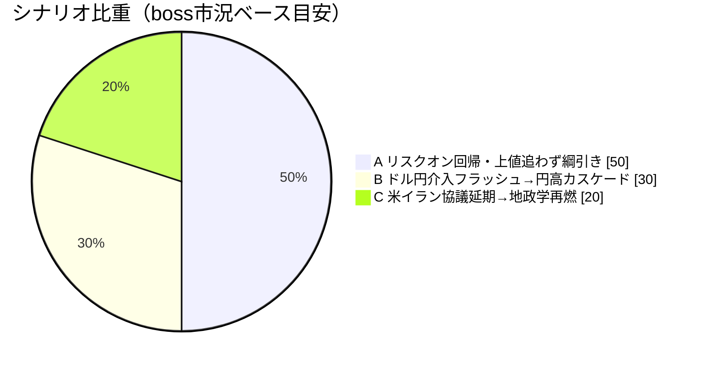
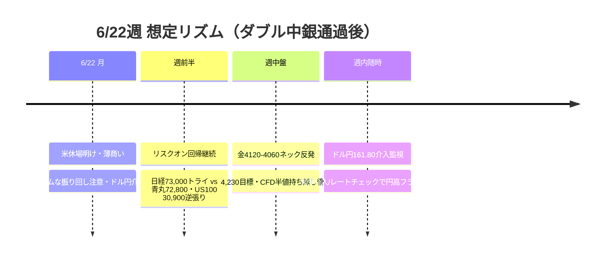

# 📌 CFD戦略ハブ — 6/22週

> [!abstract] 一行サマリー
> wk01の最大の山だった **6/16-17ダブル中銀（[[FOMC]]＋日銀）を通過**。FOMCは政策金利3.50-3.75%を4会合連続据え置き＋利上げ予想に転換。米イラン停戦＋ホルムズ海峡再開期待で[[リスクオン]]回帰、[[VIX]] 21.51→16.4で[[Add risk gate]]再開。[[WTI]]は-20.56%急落（停戦で地政学プレミアム剥落）。**今週の新キングピンは[[USDJPY]] 161.80の[[為替介入]]警戒**（2024年4月29日の介入直前とほぼ同水準）。日経は6/18終値71,053.49円で初の7万円超えも上値72,800は危険ゾーン（青丸・2倍ルール）。**[[リスクオン]]回帰 × 介入警戒で上値追わずの綱引き**。

> [!warning] [[レジーム]] / ゲート（at a glance）
> - 機械[[レジーム]]: **`Neutral`**（equities=up / oil=slump / gold=off / yields=falling で[[リスクオン]]回帰）
> - [[Add risk gate]]: **再開**（[[VIX]] 16.4 < 18）
> - [[Reduce risk gate]]: **caution**（ドル円161.80介入/日経72,800青丸/US100 30,900/US10Y>4.6%/VIX>18再上昇で発火）
> - 機械=リスクオン回帰 / boss=「介入警戒が日本株・クロス円の上値を抑える綱引き」→ *両論併記*

## 🔗 リンク

| 種別 | リンク |
|---|---|
| 📊 **詳細版（全グラフ・銘柄別・トリガー網羅）** | [[CFD_Strategy-2026-6-22.html\|CFD詳細ブリーフ HTML（外部ブラウザ）]] |
| 🧠 Rex戦略データ正本 | [[distilled-gm-2026-6]] |
| 📝 週次一次資料 | [[review]] ・ [[meta]] ・ [[2026-6-19_wk03/note\|note]] ・ [[trade_results]] |
| ⏪ 直近生成ハブ | [[CFD戦略-2026-6-8\|wk01 ハブ (6/8週)]]（※wk02はスルー） |

## 🎯 今週の要点（3行）

1. **為替**：[[USDJPY]] 161.80が今週のキングピン＝[[為替介入]]警戒（2024年4月29日介入直前水準）。上値での[[戻り売り]]の流れを意識、162一段上げからの急落（ズドン）リスク。買い上がりはバイングクライマックス警戒。実弾介入/[[レートチェック]]で円高フラッシュ。159.5割れで→156→155。
2. **株**：[[リスクオン]]回帰で[[US100]] 30,406（wk01比+5.0%）も上は火傷ゾーン＝レンジ、30,900は逆張り短期。日経7万円超も上値青丸72,800は危険ゾーン（2倍ルール）、73,000トライ後の急落と両建てで使う。上値追い厳禁。
3. **コモディティ**：[[Gold]]は4120-4060週足ネック反発買いが的中、CFD**2勝0敗+7.40%**（6/12建値4097→同日4197→6/18 4300の段階半値利確）、残1/4を建値4097で持ち越し。[[WTI]]は停戦で-20.56%急落、76.2超えから78.83自律反発の条件付き。[[BTC]]は下落相場で[[戻り売り]]（66,200割れ→60,700）。

## 📈 クイックビュー

## ⚠️ 監視トリガー（要点のみ／詳細はHTML）

- **[[USDJPY]] 161.80超で実弾[[為替介入]]/[[レートチェック]]** → 🔻 急激な円高フラッシュ（2024年8月は3週で円+10%）
- **JP225 72,800-73,000青丸拒否** → 🔻 大きな急落シナリオ（バブル期暴落幅の2倍ルール）
- [[US100]] 30,900拒否 / D1 close < 29,900 → 🟠 火傷ゾーンからの逆張り下落・調整
- [[US10Y]] 4.6%上抜け（下降ライン上限）→ ドル円上値追随の鍵 / JP10Y 2.65%上抜けで円高加速
- **[[VIX]] > 18 再上昇** → 🔻 [[Add risk gate]]再閉鎖・[[Reduce risk gate]]発火
- [[Gold]] 4120-4060週足ネック → 反発買い（→4,230）。4,020→4,120の反発も利用可
- 米イラン協議再燃（6/19延期）→ ホルムズ再封鎖懸念で[[WTI]]・[[Gold]]反発

---

> [!quote] 注記
> 本ノートは **Obsidian索引（ハブ）**。要点とリンクのみ。全グラフ・銘柄別アクション・ポートフォリオ詳細は [[CFD_Strategy-2026-6-22.html\|HTML詳細版]]。**Rex戦略データ正本は [[distilled-gm-2026-6]]**。データは 2026-6-19_wk03 確定値に忠実（創作なし・両論併記／ボス承認済）。JP225は6/18終値71,053.49円（--news #5＝snapshot8ペア外）。BOJ 6/15-16結果は1次資料に明示なし。Gold CFDは6/12建値4097→同日4197→6/18 4300の段階半値利確（2勝0敗+7.40%）、残1/4を建値4097で持ち越し（2026-06-20ボス追加提供を反映）。投資助言ではなくGM運用の作戦整理。最終判断はミナト。生成: ClaudeCode / 2026-06-20。
