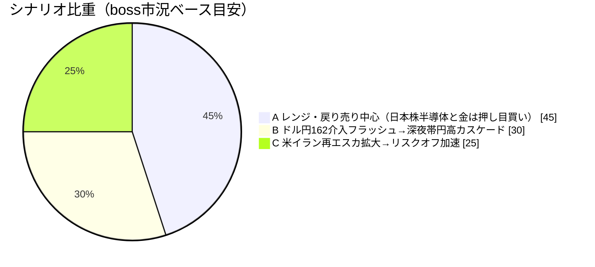
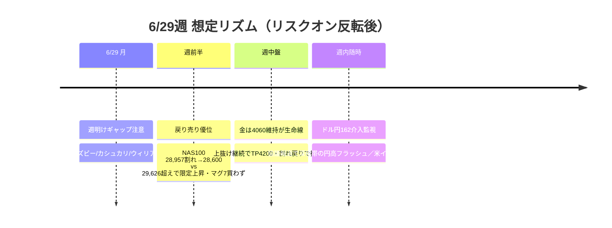

# 📌 CFD戦略ハブ — 6/29週

> [!abstract] 一行サマリー
> wk03の**[[リスクオン]]回帰が反転**した週。機械[[レジーム]]は **Neutral（equities=up / yields=falling）→ Equities Down（equities=down / yields=rising）**。三重逆風＝①**PCEデフレーター4.1%高止まり＋シカゴ連銀グールズビー総裁「物価上昇圧力は引き続き高すぎる」で利上げ警戒再点火**、②**メモリ供給不足の[[Apple]]値上げ→マグニフィセント7全面安**（メモリ株は逆行高）、③**米イラン再エスカ**（米軍イラン爆撃→イラン報復・湾岸米軍基地攻撃＋[[ホルムズ海峡]]商船攻撃）でwk03の停戦/再開から逆戻り。[[VIX]] 16.4→**18.41で18超え再上昇＝[[Add risk gate]]再閉鎖**。boss＝「レンジ前提・[[戻り売り]]中心、ただし日本株の半導体/メモリと[[Gold]]は押し目買い、[[BTC]]は[[戻り売り]]」。

> [!warning] [[レジーム]] / ゲート（at a glance）
> - 機械[[レジーム]]: **`Equities Down`**（equities=down / oil=slump / gold=off / yields=rising で株安・利上げ警戒へ反転）
> - [[Add risk gate]]: **再閉鎖**（[[VIX]] 18.41 > 18）
> - [[Reduce risk gate]]: **caution**（VIX 18超え定着／ドル円162介入／NAS100 28,957割れ／米イラン交戦拡大で発火）
> - 機械=Equities Down / boss=「レンジ・[[戻り売り]]中心、日本株半導体と金は押し目買い」→ 方向は整合・*両論併記*（gold=off vs 大底圏買い）
> - ⚠️ **金利ラベル補正**: `yields=rising` は2Y主導の丸め。実態は**ベアフラットニング**（2s10s +27.4→**+22.6bp**、US2Y↑/US10Y↓）＝債券が「利上げ→景気悪化」を織り込み始めたサイン。長期金利低下は株のロングデュレーション逆風＋景気減速兆候として二段で読む。

## 🔗 リンク

| 種別 | リンク |
|---|---|
| 📊 **詳細版（全グラフ・銘柄別・トリガー網羅）** | [[CFD_Strategy-2026-6-29.html\|CFD詳細ブリーフ HTML（外部ブラウザ）]] |
| 🧠 Rex戦略データ正本 | [[distilled-gm-2026-6]] |
| 📝 週次一次資料 | [[review]] ・ [[meta]] ・ [[2026-6-26_wk04/note\|note]] ・ [[trade_results]] |
| ⏪ 直近生成ハブ | [[CFD戦略-2026-6-22\|wk03 ハブ (6/22週)]] |

## 🎯 今週の要点（3行）

1. **マクロ反転**：利上げ警戒の再点火（PCE 4.1%＋グールズビー・タカ派）で[[リスクオン]]→Equities Down。[[VIX]] 18.41で[[Add risk gate]]再閉鎖。米株は**マグ7全面安 vs メモリ株逆行高の二極化**＝マグ7は当面買わず、メモリ/半導体は追わず押し目待ち。
2. **為替（非対称）**：[[USDJPY]] 160後半〜162レンジで「上がったら売る」。162.20-162.50上値メド・161.55到達済み。**残弾は非対称**＝IMF枠の協調弾あと1発（11月まで）＋6/23片山-ベッセント会談実施（協調レートチェックの布石・1月は10営業日2,100pips）。**「最後の協調弾が出たら155方向へ深く長い、出る前は161-162で踏まれる」**。毎朝「単独/協調（NY連銀rate check）」を判定フラグで確認。介入は経験則上24:30以降なし＝深夜帯フラッシュ。
3. **コモディティ/暗号資産**：[[Gold]]は大底圏で押し目買い（boss）。**CFDは6/25 $3,992で1Lotロング追加（15m DT上抜け確定）＋wk03残1/4（=0.5Lot・建値$4,097）を$4,060上抜けで週持越し**（当週確定0件・TP$4,200/SL$3,960）。⚠️**wk01の$4,250-4,300ソブリン床は6/24の$4,000割れで無効化＝現状の床は週足Fibo38.2 $4,060。$4,078持ち越しは$4,060のわずか$18上＝終値で$4,060割れなら一旦撤退**。[[WTI]]は**地政学テクニカル反発 vs 供給回復ファンダ重しの綱引き**（UAE85%回復・waiver発効・タンカー再稼働／68.89割れ→$66.235最終サポート）。[[BTC]]は売り継続（56,869割れ→56,000・中国スパコン暗号解読懸念）、金とは逆方向。

## 📈 クイックビュー

## ⚠️ 監視トリガー（要点のみ／詳細はHTML）

- **[[VIX]] 18超え定着** → 🔻 [[Add risk gate]]再閉鎖確定・[[Reduce risk gate]]発火。18割れ回帰で[[リスクオン]]復元の綱引き
- **2s10s 一段フラット化／逆イールド接近** → 🔻 景気後退織り込み＝リスク資産デュレーション直撃＋クレジット警戒（yields=risingの丸めに惑わされない）
- **介入の単独/協調 判定**（NY連銀 rate check 確認）→ 🔻 協調弾なら155方向へ深く長い／単独・出る前は161-162で踏まれる非対称
- **[[USDJPY]] 162台で実弾[[為替介入]]/[[レートチェック]]**（片山/佐々木×ベッセント協議報道）→ 🔻 深夜帯の急激な円高フラッシュ
- **[[US100]] 28,957割れ → 28,600** / 29,626超えで限定上昇（フィボ0.5）→ 週初の方向を決める節目・マグ7は買わず
- **米イラン交戦の拡大**（覚書履行危機）→ 🔻 原油・[[Gold]]上振れ・[[リスクオフ]]加速。ただし[[WTI]]は供給回復（UAE85%・waiver・タンカー再稼働）が重し＝$66.235割れはCushing在庫タイト次第
- **[[Gold]] 週足Fibo38.2（$4,060）＝越週ポジ生命線** → **終値で$4,060割れなら持ち越し根拠崩壊＝一旦撤退**（$4,250-4,300旧床は6/24無効化）。維持でTP$4,200／SL$3,960下抜け
- **[[BTC]] 56,869割れ → 56,000** ＋ 中国スパコン暗号解読懸念 → 売り継続
- FRB高官発言（グールズビー/カシュカリ/ウィリアムズ）→ 利上げ警戒の週明けギャップ要因

---

> [!quote] 注記
> 本ノートは **Obsidian索引（ハブ）**。要点とリンクのみ。全グラフ・銘柄別アクション・ポートフォリオ詳細は [[CFD_Strategy-2026-6-29.html\|HTML詳細版]]。**Rex戦略データ正本は [[distilled-gm-2026-6]]**。データは 2026-6-26_wk04 確定値（snapshot 2026-06-27 / boss市況 wr-2026-6-26 / --news / x_search）に忠実（創作なし・両論併記／ボス承認済）。**JP225は金曜終値の実測なし**（snapshot8ペア外・boss市況も数値明示なし）。機械=Equities Down（gold=off）と boss=大底圏で押し目買いは「実測ラベル vs 前方視点」として併記。Gold CFDは6/25 $3,992で1Lotロング追加（15m DT上抜け確定）＋wk03残1/4（=0.5Lot・建値$4,097）を建値で泳がせ、週足Fibo38.2（$4,060）上抜けで週持越し（当週確定0件・TP$4,200/SL$3,960／boss 2026-06-27追加提供を反映）。投資助言ではなくGM運用の作戦整理。最終判断はミナト。生成: ClaudeCode / 2026-06-27。
</content>
