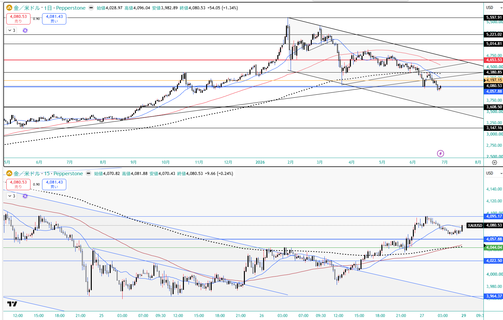

# Trade Results – 2026-06-22〜2026-06-26 (wk04)

> 当週は**確定（クローズ）トレード0件**。実現損益なし＝**保有継続＋金の押し目買い増し**の週。wk03で2勝0敗+7.40%（段階半値利確）を決めた後、boss市況「金は大底圏・ここからの売りは危険／3,930反発→4,000」に沿って **6/25 21:36に$3,992でゴールドを1Lotロング追加**、wk03残ゴールド0.5Lotと合わせて週持ち越し（越週オープン）。

## 概要

- **期間**: 2026-06-22〜2026-06-26
- **確定トレード回数**: **0**（クローズなし＝実現PnLなし）
- **勝ち / 負け**: 0 / 0
- **合計PnL (pnl_pct合計)**: **±0.00%**（当週確定なし）
- **保有（越週オープン）**:
  - ゴールド **残1/4ロット（=絶対0.5Lot・建値$4,097）**（wk03の4120-4060週足ネック反発買いロングの残り。wk03当初2Lotの段階利確後の1/4＝0.5Lot。建値で決済せず泳がせた）
  - ゴールド **6/25 21:36 $3,992で1Lotロング追加**（15分足ディセンディングトライアングル上抜けの5m足確定でエントリー）
  - ＝ゴールドロングをネット増し玉して週持ち越し

## トレード一覧（track_trades.py summary / 2026-06-08〜2026-06-27）

> 当週（6/22-6/26）に新規クローズはなし。下表は参考として wk03 の確定2件（既報・実現済）を再掲。当週の保有/追加は未決済のため CSV 行は追加していない（下記「記録方針」）。

| opened_at | closed_at | symbol | dir | size | entry | exit | pnl_% | tag | notes |
|-----------|-----------|--------|-----|------|-------|------|-------|-----|-------|
| 2026-06-12 09:00 | 2026-06-12 21:00 | XAUUSD | long | 0.50 | 4097.00 | 4197.00 | +2.44 | gold_long,partial_tp | （wk03既報）建値4097の半値を同日4197で利確 |
| 2026-06-12 09:00 | 2026-06-18 15:00 | XAUUSD | long | 0.25 | 4097.00 | 4300.00 | +4.95 | gold_long,partial_tp,carryover | （wk03既報）残半値を6/18 4300で更に半値利確。残を週持ち越し |

---

## ポジション詳細（当週・越週オープン）

### Gold CFD（XAUUSD）ロング — 大底圏の押し目買い増し玉

| 項目 | 内容 |
|---|---|
| 方向 | LONG（boss戦略：大底圏の押し目買い・3,930反発→4,000） |
| 保有（継続） | wk03からの **残1/4ロット（=絶対0.5Lot・建値$4,097）**。wk03当初2Lotの段階利確後の残り。建値で決済せず泳がせて週持ち越し |
| 追加（新規） | **6/25 21:36 $3,992で1Lotロング追加**。**15分足ディセンディングトライアングル上抜けの5m足確定**でエントリー |
| 当初の利確/損切 | 利確＝**$4,200水準**（オレンジライン＝日足上昇トレンドライン裏確認）／ 損切＝**$3,960下抜け確定** |
| 週持越しへの移行 | 週末時点で **4Hネック＋週足上昇波フィボ38.2（青ライン$4,060水準）を上抜け**たため、当初の当週利確/損切から**週持越しに移行**。日足終値$4,080.53（+1.34%） |
| 当週確定PnL | **なし**（クローズなし＝実現損益0。両ポジとも越週オープン） |
| 自己評価 | 4H環境足で少しリスクを取った形（boss） |

**読み（Why）— boss戦略メモ（2026-06-27 追加提供）**:
- **残1/4（=0.5Lot・建値$4,097）を建値で泳がせた判断**: 先週末にかけてドル円が162円の介入警戒水準で小幅レンジ推移だった一方、ゴールドは **$4,000のキリ番目前＝週足抵抗帯の押し目水準** にあったため、残1/4を建値で決済せず保有継続（泳がせ）。
- **6/25の1Lot追加**: **15分足のディセンディングトライアングル上抜けを5分足確定**で捉えてエントリー（$3,992）。当初プランは利確$4,200（オレンジ＝日足上昇トレンドライン裏確認）・損切$3,960下抜け確定。
- **週持越しへ移行した根拠**: 週末時点で **4Hネックと週足上昇波フィボ38.2（青ライン$4,060水準）を上抜け** てきたため、当週決済ではなく週持越しへ。「正直、4H環境足で少しリスクを取った形」（boss自己評価）。
- boss市況はゴールドを「ビットコインとは切り離して強気」、日足で2年前サポートに迫る大底圏＝「ここからの売りは危険」、シルバーも大底圏と位置づけ。snapshot機械レジームは gold=off（30日-9.35%）継続だが、boss・X市況とも「押し目買い視点残存」＝機械=off と前方視点=大底圏買いを両論併記。

**執行の質（重要）**:
- 当週は確定トレードを発生させず＝**規律的な保有継続**（残1/4を建値で泳がせ＋4060上抜けで週持越しへ移行）。
- 利上げ警戒・株安方向（Equities Down・VIX>18）の地合いで、相関分離している金（boss強気）に押し目買いを集中させるヘッジ的アロケーション。
- 増し玉は1Lotに限定（フルサイズの積み増しではなく、大底圏の分割買いの初手）。テクニカルは15m上抜け確定→4H/週足の節目（$4,060）上抜けで保有延長と、マルチタイムフレームの根拠を積み上げた執行。

**チャート（boss提供・2026-06-27）**: `charts/Gold-XAUUSD-2026-06-27.png`（金/米ドル 日足＋15分足・Pepperstone）。日足は$4,197（オレンジ＝日足上昇トレンドライン裏／利確メド）・$4,060（青＝週足Fibo38.2／越週ポジ生命線）・$3,608/$3,147サポートの大底圏。15分足はディセンディングトライアングル上抜け→$3,964底から反発し$4,095まで上昇。日足終値$4,080.53（始値4,028.97 / 高値4,096.04 / 安値3,982.89 / +1.34%）。

**記録方針**:
- 当週は**クローズ（確定）なし**のため track_trades.py `add`（entry/exit/PnL確定が必須）への新規行追加はしない（不変ルール7：実現していない損益や創作のexitを書かない）。保有/追加は本 trade_results.md・review.md・note.md でリポ保全。
- 数量はboss提供の絶対ロット（残0.5Lot＋追加1Lot）を記載。wk03までのCSVは相対表記（0.5=半値等）で、スケールが異なる点に留意（無理な統一・換算はしない）。
- `data/private_trades.csv` は .gitignore 対象（ローカル専用）。force追加要否はボス判断。

---

## 今週の市況コンテキスト

### 利上げ警戒の再点火
- PCEデフレーター4.1%の高止まり＋シカゴ連銀グールズビー総裁「物価上昇圧力は引き続き高すぎる」。
- 反応: snapshot yields=rising・equities=down。VIX 16.4→18.41でAdd risk gate再閉鎖。

### Mag7メモリ転嫁の株安
- メモリ/ストレージ供給不足のコスト上昇でAppleが一斉値上げ（--news #4）。マグ7全面安 vs メモリ株（マイクロン等）逆行高。
- boss: マグ7は当面買わず、メモリ/半導体は追わず押し目待ち。日本株では半導体/メモリ/MLCCを押し目買いのヘッジ。

### 米イラン再エスカ
- 米軍がイラン施設爆撃→イラン報復・湾岸米軍基地攻撃（--news #1）＋ホルムズ商船攻撃（--news #2）。wk03の停戦/ホルムズ再開から逆戻り。
- WTIは反発局面入りも勢い弱い1/3戻し。68.89割れ→下落／74.68反発の条件付き。

---

## 来週への申し送り

1. **ゴールド増し玉（残1/4=0.5Lot建値$4,097＋6/25 $3,992の1Lot）の管理**: $4,060（週足Fibo38.2・青）上抜けを維持できるかが越週ポジ継続の生命線。上は**$4,200（オレンジ＝日足上昇トレンドライン裏）が利確メド**、下は**$3,960下抜けが損切基準**。4H環境足で取ったリスク分、$4,060割れ戻りなら早めの撤退も選択肢。**床の更新に注意**：distilled wk01の$4,250-4,300ソブリン買いゾーンは6/24夜の$4,000割れ（テック換金売り＋debasement巻き戻しのトレンド清算）で**無効化**＝現状の床は$4,060。$4,078持ち越しは床のわずか$18上・SL$3,960まで$118の薄いクッション＝**終値で$4,060を割ったら持ち越し根拠（Fibo38.2上抜け）が崩れるため一旦撤退**。boss市況「3,930反発→4,000」とCFD「$3,992ロード済」は、$3,992が3,930ゾーン上方で既にロード済・$3,930はより深い予備押し目、と整理。
2. **ドル円162介入警戒**: 160後半〜162「上がったら売る」。162.20-162.50上値メドからの戻り売り。片山/佐々木×ベッセント協議報道で深夜帯の円高フラッシュ。短期売り抜け前提でロングは慎重。
3. **株は上値追わず戻り売り**: NAS100 28,957割れ→28,600下抜け想定が主筋、29,626超えからの限定上昇のみ逆張り。マグ7は当面買わず。日本株（半導体/メモリ）は相対的に強く押し目買い。
4. **BTCは売り継続**: 56,869割れ→56,000。利上げ警戒＋中国スパコン暗号解読懸念。金とは逆方向。独立妙味なし・監視。
5. **トリガー監視**: VIX 18上抜け定着 / ドル円162介入有無 / NAS100 28,957・29,626 / 米イラン交戦の行方（覚書履行危機） / FRB高官発言（グールズビー/カシュカリ/ウィリアムズ）。

---

*Filed: 2026-06-27（土）— ClaudeCode 週末更新工程 / Minato 提供トレード結果（残0.5Lot＋6/25 21:36 $3,992ロング追加・週持ち越し）より*
</content>
