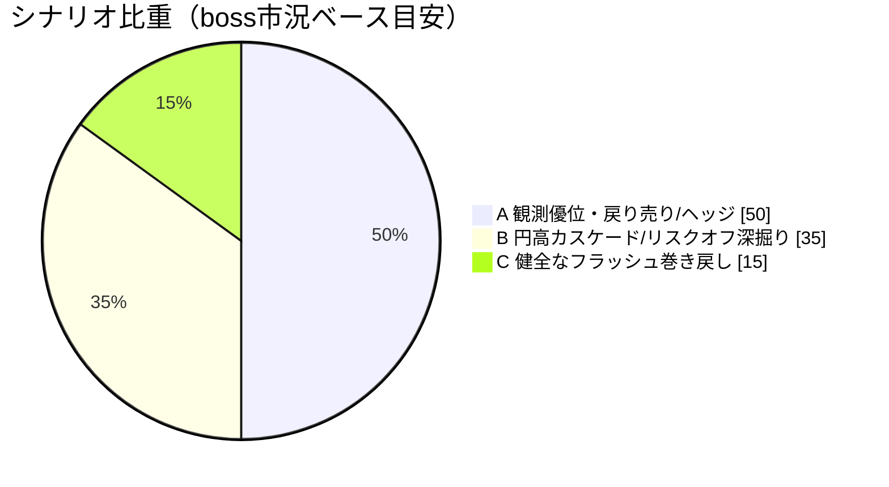
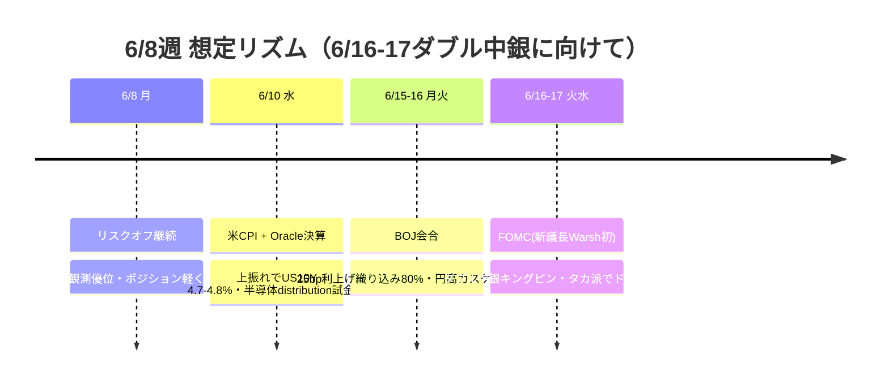

# 📌 CFD戦略ハブ — 6/8週

> [!abstract] 一行サマリー
> NFP 172K（予想85K）＋上方修正の "good news is bad news" で楽観相場が一気に[[リスクオフ]]へ。[[VIX]] 21.51（6/5単日+39-40%）で[[Add risk gate]]閉・[[Reduce risk gate]]成立、[[US100]]は半導体distribution主導で急落、[[Gold]]は2026年安値（off）、[[BTC]]は$60,000割れ19ヶ月安値。[[USDJPY]] 160突破が今週のキングピン。全資産が「ドル円160 × 満タン円ショート × [[円キャリー巻き戻し]] × 6/16-17ダブル中銀（[[日銀利上げ]]＋[[FOMC]]）」の一枚岩。**6/16-17まで観測優位・[[戻り売り]]/ヘッジ優位**。

> [!warning] [[レジーム]] / ゲート（at a glance）
> - 機械[[レジーム]]: **`Neutral`**（equities=flat / gold=off / crypto=weak で内部[[リスクオフ]]）
> - [[Add risk gate]]: **閉**（[[VIX]] 21.51 > 18）
> - [[Reduce risk gate]]: **成立中**（[[VIX]] > 18・wk05ゲート発火）
> - 機械=Neutral / boss=「スタグフレーション＋ダブル引き締め・下方テール一段重く」→ *両論併記*

## 🔗 リンク

| 種別 | リンク |
|---|---|
| 📊 **詳細版（全グラフ・銘柄別・トリガー網羅）** | [[CFD_Strategy-2026-6-8.html\|CFD詳細ブリーフ HTML（外部ブラウザ）]] |
| 🧠 Rex戦略データ正本 | [[distilled-gm-2026-6]] |
| 📝 週次一次資料 | [[review]] ・ [[meta]] ・ [[2026-6-5_wk01/note\|note]] ・ [[trade_results]] |
| ⏪ 直近生成ハブ | [[CFD戦略-2026-5-18\|wk03 ハブ (5/18週)]]（※wk04/wk05はハブ未生成） |

## 🎯 今週の要点（3行）

1. **株**：[[US100]]は[[戻り売り]]優位（半導体distribution主導・Broadcom-12%・9週連騰ストップ）。27,989赤丸が下値の最終防衛、割れで下加速。高値追い厳禁。JP225は最も脆い（[[円キャリー巻き戻し]]＋米株[[リスクオフ]]のダブルパンチ）、新規買い見送り。
2. **為替**：[[USDJPY]] 160が今週のキングピン。160売りは[[為替介入]]取りの高勝率だが介入なしだと金利差で踏まれる両刃。**ノーポジ推奨ゾーン**。159.5割れで巻き戻し→156→155。
3. **ヘッジ**：[[Gold]]はCFD残ポジ4390で全撤退済（防衛的）。$4,250-4,300のソブリン買いゾーンで分割買い場待ち。[[BTC]]は[[リスクオフ]]増幅器で監視のみ。

## 📈 クイックビュー

## ⚠️ 監視トリガー（要点のみ／詳細はHTML）

- **[[VIX]] > 18（成立中）/ > 22** → 🔻 [[Reduce risk gate]]発火中・構造的[[リスクオフ]]加速
- [[US100]] < 27,989 → 🟠 調整深掘り（下値の最終防衛割れ）
- [[US10Y]] > 4.6%（5%窺う）→ 🔻 米株デュレーション直撃・調整加速
- [[USDJPY]] 160実弾[[為替介入]]/[[レートチェック]] → 🔻 急激な円高フラッシュ（2024年8月は3週で円+10%）
- **JP10Y > 2.9%** → 🔻 株式エクスポージャー一段落とし
- [[Gold]] $4,336割れ → $4,300/$4,250（ソブリン買いゾーン・分割で拾う）

---

> [!quote] 注記
> 本ノートは **Obsidian索引（ハブ）**。要点とリンクのみ。全グラフ・銘柄別アクション・ポートフォリオ詳細は [[CFD_Strategy-2026-6-8.html\|HTML詳細版]]。**Rex戦略データ正本は [[distilled-gm-2026-6]]**。データは 2026-6-5_wk01 確定値に忠実（創作なし・両論併記／ボス承認済）。JP225は金曜終値の実測なし（snapshot8ペアに含まず）。投資助言ではなくGM運用の作戦整理。最終判断はミナト。生成: ClaudeCode / 2026-06-07。
