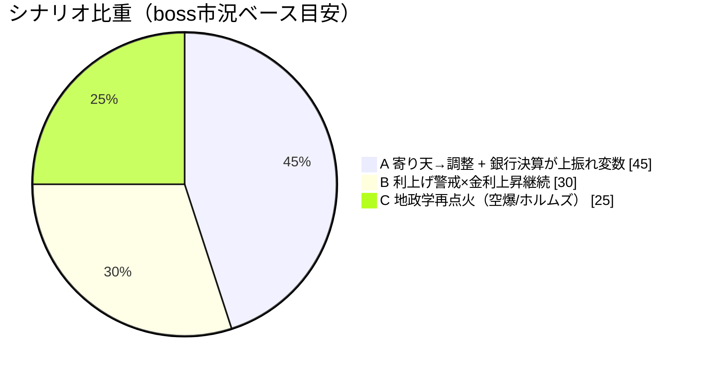
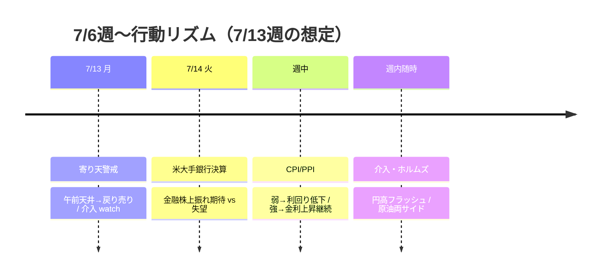

# 📌 CFD戦略ハブ — 7/6週

> [!abstract] 一行サマリー
> wk01の **Equities Down** から機械[[レジーム]]が **[[リスクオン]]寄りではないが Neutral（equities=flat / yields=rising）** へ転換。[[VIX]] 15.03で [[Add risk gate]] は継続開放。boss主筋は「株＝[[寄り天]](午前天井)→一旦調整／為替＝レンジ」。背景はメモリー・半導体の買い戻し、金曜時点の米イランリスク後退、ウィリアムズ総裁のインフレ警戒。最大イベントは **7/14 米大手銀行決算**。[[USDJPY]] 161.672で intervention=watch（[[為替介入]]警戒）。[[Gold]] CFD は 7/11 0:15 **$4104.5 で +0.5pips → Total 1.5pips 週持越し**（日足環境・4Hトレード足スウィング継続）。

> [!warning] [[レジーム]] / ゲート（at a glance）
> - 機械[[レジーム]]: **`Neutral`**（equities=flat / vol=normal / oil=range / gold=off / crypto=range / yields=rising）
> - [[Add risk gate]]: **開放継続**（[[VIX]] 15.03 < 18）
> - [[Reduce risk gate]]: **caution**（VIX18再上抜け／介入フラッシュ／ホルムズ継続／銀行決算失望／三角下抜けで発火）
> - 機械=Neutral＋低ボラ / boss=寄り天→調整の戻り売り目線 → **高値追わずの Neutral**
> - ⚠️ **地政学時間差**: Boss金曜「イランリスク後退」 vs `--news`(7/12)「米軍空爆再開・[[ホルムズ海峡]]閉鎖」＝混同せず来週監視

## 🔗 リンク

| 種別 | リンク |
|---|---|
| 📊 **詳細版（全グラフ・銘柄別・トリガー網羅）** | [[CFD_Strategy-2026-7-13.html\|CFD詳細ブリーフ HTML（外部ブラウザ）]] |
| 🧠 Rex戦略データ正本 | [[distilled-gm-2026-7]] |
| 📝 週次一次資料 | [[review]] ・ [[meta]] ・ [[2026-7-10_wk02/note\|note]] ・ [[trade_results]] |
| ⏪ 前週 | [[2026-7-3_wk01/review\|wk01 review]] |

## 🎯 今週の要点（3行）

1. **レジーム転換**: Equities Down→**Neutral**。[[US100]] 29,825（+1.7%）・[[BTC]] 64,127（+4.3%）・[[VIX]]15。ただし金利は **rising**（US10Y 4.57 / US2Y 4.31）で上値抑制。bossは寄り天→調整。
2. **触媒と介入**: **7/14 銀行決算**が最大イベント。[[USDJPY]] は **watch 帯**（不意打ち円買い[[為替介入]]警戒・数円の円高注意）。CPI/PPI が金利方向を左右。
3. **金スウィング継続**: CFD **Total 1.5pips @4104.5**（7/11 0:15 に +0.5）。4Hダウ崩れ・15m実体確定で管理。上値4138/4175、押し目4080。

## 📈 クイックビュー

## ⚠️ 監視トリガー（要点のみ／詳細はHTML）

- **7/14 米大手銀行決算** → 金融株経由で指数の上振れ/失望
- **CPI / PPI** → 弱＝利回り低下（株・金・円高）、強＝利回り上昇継続
- **[[USDJPY]] 不意打ち[[為替介入]]**（watch≥161.5 / stage=meeting_held）→ 数円の円高フラッシュ
- **[[VIX]] 18再上抜け定着** → 🔻 [[Add risk gate]]閉鎖・[[Reduce risk gate]]発火
- **[[US100]] 三角持ち合いの上抜け/下抜け** → boss「下落相場になりそう」を優先し高値追い抑制
- **[[Gold]] 4138 / 4080 / CFD 4Hダウ崩れ** → 乗せ or 決済
- **イラン・[[ホルムズ海峡]]続報**（--news 7/12）→ [[WTI]] 72.17/71.23 両サイド
- **[[BTC]] 61,477割れ** → 60,000 下落フローのみ（上はシグナル待ち）

---

> [!quote] 注記
> 本ノートは **Obsidian索引（ハブ）**。要点とリンクのみ。全グラフ・銘柄別アクション・ポートフォリオ詳細は [[CFD_Strategy-2026-7-6.html\|HTML詳細版]]。**Rex戦略データ正本は [[distilled-gm-2026-7]]**。データは 2026-7-10_wk02 確定値（snapshot 2026-07-12 / boss市況 wr-2026-7-10 / --trade --news）に忠実（創作なし・関所7.5承認済）。X headlines は空出力。Portfolio-Total 画像は未提供（JP/USのみ）。投資助言ではなくGM運用の作戦整理。最終判断はミナト。生成: Hermes Grok / gm-weekly-update / 2026-07-12。
