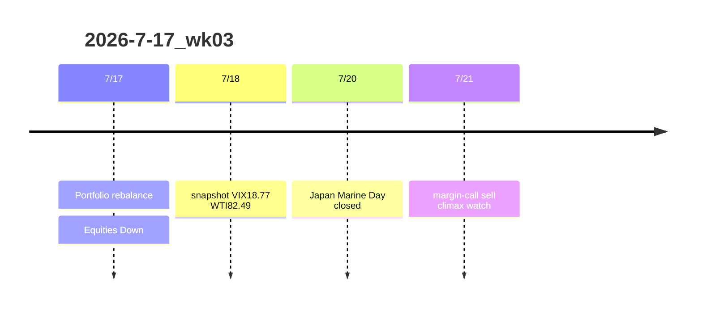

# CFD戦略-2026-7-20

## 要点3行
- [[VIX]] 18.77で[[Add risk gate]]閉鎖。[[US100]]/[[JP225]]はセリクラ待ち。
- [[WTI]] 82.49へ急伸、[[中東リスク]]とインフレ再燃が株の重し。
- [[Gold]] CFDは$3,950日足ネック維持、1.5Lotを日足環境足スウィングで週持越し。

## Mermaid timeline

## Trigger要点
- Add risk再開: VIX<18 + セリクラ反発 + WTI上振れ一服
- Reduce: VIX>20 / WTI>83.82 / USDJPY介入フラッシュ / US100下抜け継続
- Gold CFD: $3,950日足ネック、$3,900〜3,920反発ライン

## Links
| 種別 | Link |
|---|---|
| HTML詳細 | [CFD_Strategy-2026-7-20.html](./CFD_Strategy-2026-7-20.html) |
| distilled | [distilled-gm-2026-7](../../../distilled/2026/distilled-gm-2026-7.md) |
| review | [review](./review.md) |
| meta | [meta](./meta.yaml) |
| note | [note](./note.md) |
| charts | [charts](./charts.md) |
| 前週 | [2026-7-10_wk02](../2026-7-10_wk02/CFD戦略-2026-7-13.md) |
