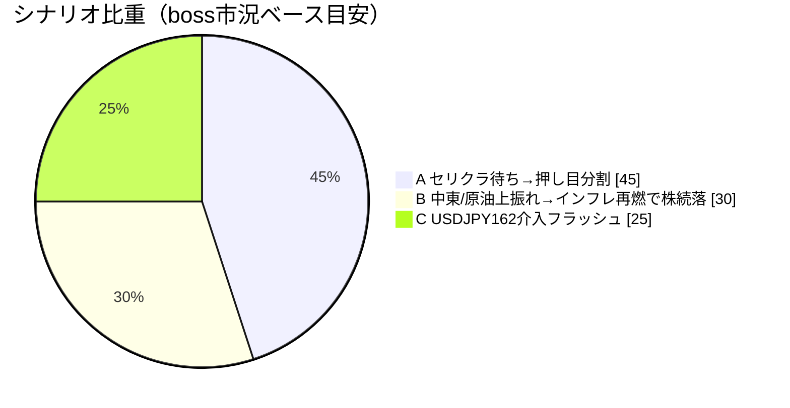
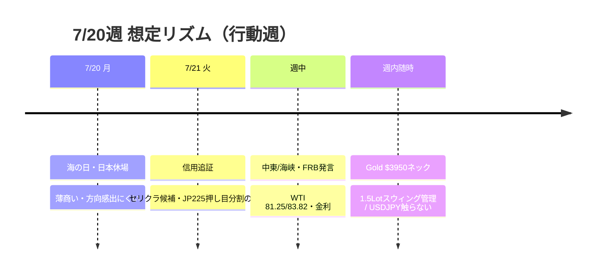

# 📌 CFD戦略ハブ — 7/20週

> [!abstract] 一行サマリー
> wk02の **[[リスクオン]]ではない Neutral** から、機械[[レジーム]]が **Equities Down** へ再悪化。[[VIX]] 18.77で [[Add risk gate]] 閉鎖。boss主筋は「**セリングクライマックス待ち**」— 米イラン連日攻撃・[[ホルムズ海峡]]/バブエルマンデブ封鎖懸念、FRB追加引き締め観測、AI/メモリ急落が重なり [[US100]]/[[JP225]] は下目線。[[USDJPY]] 162.353で intervention=watch かつ upper_alert（原則触らない）。[[Gold]] CFDは **wk02から Total 1.5Lot 持越し継続**（日足ネック$3,950／三角フラッグ／日足環境足スウィング。当週新規なし）。

> [!warning] [[レジーム]] / ゲート（at a glance）
> - 機械[[レジーム]]: **`Equities Down`**（equities=down / oil=range / gold=off / yields=rising）
> - [[Add risk gate]]: **閉鎖**（[[VIX]] 18.77 > 18）
> - [[Reduce risk gate]]: **caution**（VIX20超／WTI83.82超／介入フラッシュ／三角下抜け／追証売り加速で発火）
> - 7/20(月) 海の日で日本休場 → **火曜の信用追証**がセリクラ候補
> - CFD正本: **wk02→1.5Lot持越しのみ**（$3,950ネック未割れ・三角フラッグ）

## 🔗 リンク

| 種別 | リンク |
|---|---|
| 📊 **詳細版（全グラフ・銘柄別・トリガー網羅）** | [CFD_Strategy-2026-7-20.html](./CFD_Strategy-2026-7-20.html) |
| 🧠 Rex戦略データ正本 | [[distilled-gm-2026-7]] |
| 📝 週次一次資料 | [[review]] ・ [[meta]] ・ [[2026-7-17_wk03/note\|note]] ・ [[trade_results]] |
| ⏪ 前週ハブ | [[2026-7-10_wk02/CFD戦略-2026-7-13\|wk02 ハブ]] |

## 🎯 今週の要点（3行）

1. **レジーム再悪化**: Equities Down。[[US100]] 28,593（-4.1%）・[[JP225]] 64,141（-6.4%）・[[VIX]]18.77で Add 閉鎖。[[WTI]] 82.49（+15.5%）が中東プレミアム。
2. **セリクラ二段構え**: 7/20休場→火曜追証売りを待ち、JP225は63,600周辺の押し目を分割候補。中期は「日本は結局強い」。
3. **Gold 持越し**: **1.5Lotは wk02 からの継続のみ**。$3,950日足ネック／三角フラッグ／日足スウィング。USDJPYは触らない。

## 📈 クイックビュー

## ⚠️ 監視トリガー（要点のみ／詳細はHTML）

- **[[VIX]] 18割れ回帰 / 20超え定着** → Add 再開 vs Reduce 強化
- **7/21 追証売り・セリクラ** → [[JP225]] 63,600 反発帯 vs 63,000/60,820 下落加速
- **[[US100]] 28,075割れ / 28,685反発 / 29,229戻り**（Boss「2万875 / 2万8685 / 2万9229」正規化済）
- **[[WTI]] 81.25超→83.82** → 原油上昇利用＋株へのインフレ逆風
- **[[USDJPY]] 162台 [[為替介入]] / [[レートチェック]]** → 原則トレード不可、161.90反発のみ小さく
- **[[Gold]] $3,950日足ネック / $3,900–3,920** → 1.5Lot 持越しの生命線
- **[[BTC]] 63,200** → 下落方向のみ（量子+AI暗号リスクで上昇非利用）
- **トランプ朝10時演説 / 海峡封鎖有無**

---

> [!quote] 注記
> 本ノートは **Obsidian索引（ハブ）**。全グラフ・銘柄別・口座画像は [HTML詳細版](./CFD_Strategy-2026-7-20.html)。**Rex正本は [[distilled-gm-2026-7]]**。データは 2026-7-17_wk03 確定値（snapshot 2026-07-18 / wr-2026-7-17 / --trade --news）＋Boss CFD正本（wk02→1.5Lot持越し・$3950ネック）。US100水準の20xxx誤読はGrok監査で28,075/28,685に訂正。投資助言ではなくGM作戦整理。最終判断はミナト。生成: Hermes Grok パッチ / 2026-07-18。
