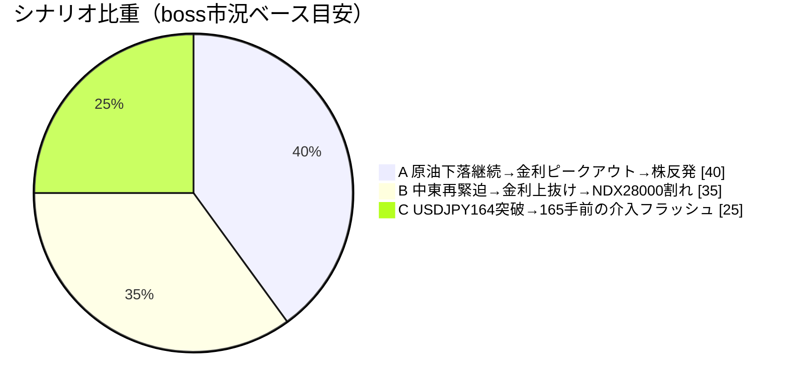
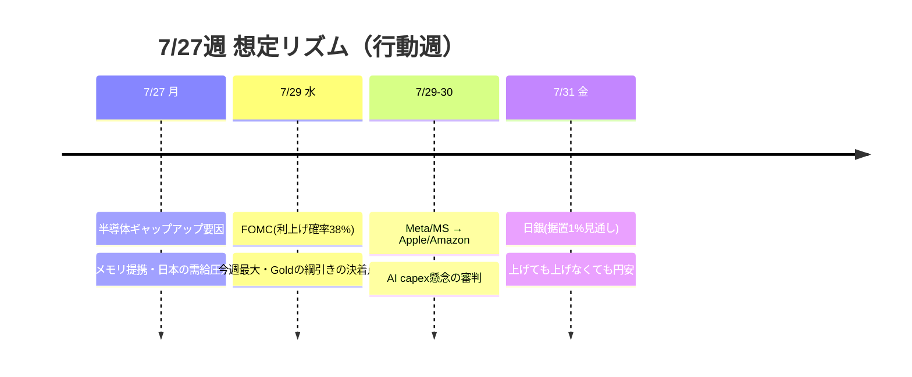

# 📌 CFD戦略ハブ — 7/27週

> [!abstract] 一行サマリー
> **金曜に相場の骨格が入れ替わった週**。木曜NY後の「原油高→インフレ→FRB利上げ→株全売り」が、**米イラン協議継続報道＋IEA/OECD戦略備蓄追加放出観測**で [[WTI]]・Brent急落（Brent -3.88%）→ **NYダウ +0.46%・S&P500 +0.05% がプラス転換し、下げたのは [[US100]]（NDX）と日経・韓国だけ**＝**指数間の完全分裂**。「WTI100ドル→株全滅」は一旦否定。共通ドライバーは**金利**で [[US10Y]] 4.679%（52週高値4.714の後・**18カ月ぶり高水準**）／US2Y 4.331%（同4.366の後）、**FOMC利上げ確率 0%近辺→38%**。NDX下落主因は **Alphabet・Tesla決算のAI capex懸念**、対して週末に**計9,500億ドルのメモリ供給提携**＝半導体は選別。[[USDJPY]] は**52週高値164.00に張り付き[[為替介入]]未実施**。[[Gold]] CFDは **1.5Lot持越し継続**（$3,950ネック未割れ→**三角フラッグから日足実体上抜け**→**4H上昇3波の起点**）。

> [!warning] [[レジーム]] / ゲート（at a glance）
> - 機械[[レジーム]]: **`Equities Down / Oil Surge`**（equities=down / **oil=surge** / **gold=range** / **crypto=strong** / yields=rising）← wk03からラベル継続も**内部3項目が転換**
> - [[Add risk gate]]: **閉鎖継続**（[[VIX]] 18.58 > 18・**2週連続**）
> - [[Reduce risk gate]]: **caution**（US10Y 4.714 or US2Y 4.366上抜け／NDX 28,173明確割れ→28,000／WTI 96台／USDJPY 165手前の介入／VIX20超えで発火）
> - ⚠️ **WTIソース乖離**: 機械 89.310 vs Boss金曜引け **85.15** → **"Oil Surge"部分はこの乖離に依存**（85.15なら約+18%＝range相当）。両論併記で扱う
> - CFD正本: **wk02→1.5Lot持越しが継続**（当週も新規なし）

## 🔗 リンク

| 種別 | リンク |
|---|---|
| 📊 **詳細版（全グラフ・銘柄別・トリガー網羅）** | [CFD_Strategy-2026-7-27.html](./CFD_Strategy-2026-7-27.html) |
| 🧠 Rex戦略データ正本 | [[distilled-gm-2026-7]] |
| 📝 週次一次資料 | [[review]] ・ [[meta]] ・ [[2026-7-24_wk04/note\|note]] ・ [[trade_results]] |
| ⏪ 前週ハブ | [[2026-7-17_wk03/CFD戦略-2026-7-20\|wk03 ハブ (7/20週)]] |
| 🌳 システムの年輪（本週で実測検証） | [2026-06-27 belly_elevated](../../../docs/system/2026-06-27_belly-elevated_rex-curve-error.md) |

## 🎯 今週の要点（3行）

1. **指数一括で見ない**：金曜の原油巻き戻しで **ダウ/S&Pはプラス転換、NDX・日経・韓国だけ下落**＝全面[[リスクオフ]]ではない。[[US100]] は**生死ライン28,173を終値で割り込み**（先物28,282はライン上・28,212割れで加速、上は28,700-28,736の壁）。**AI capex懸念（Alphabet/Tesla）と9,500億ドルメモリ供給提携が同時進行**＝銘柄選別の局面。
2. **金利がすべての共通ドライバー**：[[US10Y]] 4.679（52週高値**4.714**）／US2Y 4.331（同**4.366**）、利上げ確率**38%**。**US2Y STOCHRSI 100＝短期ピークアウト警戒**が反転トリガー（実現なら**ドル安・金高・ハイテク反発**）。逆に上抜けなら**株・金・BTCすべてに追加打撃**。
3. **[[Gold]] は"防御"から"波動の初動"へ**：$3,950ネック未割れのまま**三角フラッグから日足実体上抜け**、週末は**4H上昇3波の起点**。**4,040が上下の分岐**（上4,085.20／下4,000）、**FOMC(7/29)が綱引きの決着点**。[[USDJPY]] は164突破で165まで真空だが**165到達前の急落が最大の非対称性**＝**上目線でも建玉を軽くする**。

## 📈 クイックビュー

## ⚠️ 監視トリガー（要点のみ／詳細はHTML）

- **[[US10Y]] 4.714 / US2Y 4.366 の上抜け** → 🔻 株・金・BTCすべてに追加打撃 ／ 逆に **US2Y STOCHRSI 100 からのピークアウト** → 🟢 ドル安・金高・ハイテク反発
- **[[US100]] 28,173 明確割れ → 28,000割れ**（先物28,212割れで加速）／ 上は 28,700-28,736 の壁
- **[[USDJPY]] 164.00突破 → 164.60 → 165（介入ライン）の真空** → 🔻 **165到達前の急落が最大の非対称性**（片山財務相「果断な措置」・財務省の介入示唆）。163.64割れで押し目
- **[[Gold]] 4,040 の分岐** → 上4,085.20／下4,000、**最終防衛は日足ネック$3,950**（日足実体割れで三角フラッグ上抜けの根拠が否定）
- **[[WTI]] 83.80-87.25 が基準** → 上は93.60→96.2/96.8でインフレ再燃、下は83.80割れ。**地政学で±4%飛ぶため両サイドともサイズを抑える**
- **[[VIX]] 18割れ回帰 / 20超え定着** → [[Add risk gate]]再開 vs [[Reduce risk gate]]強化
- **[[BTC]] 63,800.5 の分岐** → 割れれば新たな下値模索、戻りは64,191→64,576（**旧サポートが抵抗に転換**）
- **7/29 FOMC（利上げ確率38%）/ 7/31 日銀（据置1%）/ 日本の半導体決算**（アドバンテスト・東エレク・キオクシア）

---

> [!quote] 注記
> 本ノートは **Obsidian索引（ハブ）**。全グラフ・銘柄別・口座画像は [HTML詳細版](./CFD_Strategy-2026-7-27.html)。**Rex正本は [[distilled-gm-2026-7]]**。データは 2026-7-24_wk04 確定値（snapshot 2026-07-25 / Boss wr-2026-7-24＝答え合わせ形式 / --trade --news）＋Boss CFD正本（1.5Lot持越し・$3,950ネック未割れ・三角フラッグから日足実体上抜け・4H上昇3波起点）。**WTIは機械89.310とBoss金曜引け85.15に乖離があり "Oil Surge" ラベルはこれに依存**（両論併記・創作補完なし）。**X headlines は2週連続でライブ検索不可＝Evidence非採用**。介入 `coord_stage` は口先介入が強化されたがNY連銀 rate check 未確認のため **meeting_held 据置**。★本週、Boss1次の真の2年債4.331%により **真の2s10s +34.8bp > 機械5s10s +25.3bp** が確認され、[2026-06-27の年輪](../../../docs/system/2026-06-27_belly-elevated_rex-curve-error.md) の proxy caveat が**実測で裏付けられた**。投資助言ではなくGM作戦整理。最終判断はミナト。生成: ClaudeCode / 2026-07-25。
</content>
