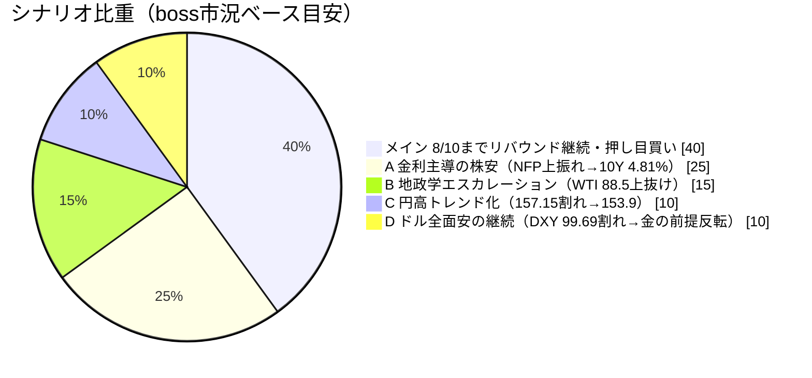
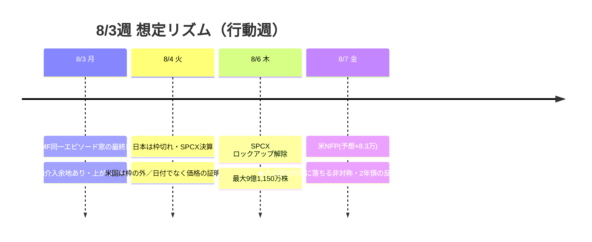

# 📌 CFD戦略ハブ — 8/3週

> [!abstract] 一行サマリー
> ★**15年ぶりの日米協調介入**が入った週。7/30(木)NY時間に [[USDJPY]] **163→158**（円は最大3.3%急騰、**ドルは2023年1月以来最大の日次下落**）、7/31に米財務省が複数行へ「待機」通告。**--news #5（読売）が「日米が協調為替介入 15年ぶり」を確定報道**。骨格は「**AI/クラウド決算による株の復活 × 原油高と長期金利上昇 × 円買い介入**」の三つ巴。[[FOMC]]は5会合連続据え置きも**9対3**（3名が利上げ方向に反対＝2016年9月以来）、**9月利上げ確率64%**。**wk04の「AI capex懸念」は「懸念でなく選別」へ決着**（AWS+37%/Azure+43%/Alphabet+82%、**Metaのみ-8.8%**）。[[VIX]] 15.99で**18割れ＝[[Add risk gate]]再開**だが、Bossの時間軸観は「**8/10までは上値を試す、以降は一段の下落を警戒**」＝**期間限定**。[[Gold]] CFDは**7/31 21:31に0.5Lotを$4,048で利確（+1.45%）**、残**1Lot**持越し。

> [!warning] [[レジーム]] / ゲート（at a glance）
> - 機械[[レジーム]]: **`Equities Down / Oil Surge`**（equities=down / oil=surge / **gold=off** / **crypto=range** / yields=rising）← wk04から **gold range→off・crypto strong→range** と内部悪化
> - [[Add risk gate]]: ★**再開**（[[VIX]] 15.99 < 18・2週閉鎖から転換）／ただし**8/10までの期間限定の上値トライ許可**
> - [[Reduce risk gate]]: **caution**（US10Y 4.745-4.810上抜け／強いNFPでUS2Y 4.34-4.42急騰→フラット化／NAS100 27,700割れ・日経64,500割れ／WTI 88.53上抜け／ドル円157.15割れ／**DXY 99.69割れ**で発火）
> - **[[為替介入]]**: `coord_stage` **meeting_held→executed（2段跳躍）**／`imf_ammo` **1→0**／**8/3(月)まで同一エピソード窓、8/4以降は4回目で分類逸脱**
> - ★**DXY 99.69 が [[Gold]] の単独スイッチ**（現値 **99.802＝わずか0.11の距離**）

## 🔗 リンク

| 種別 | リンク |
|---|---|
| 📊 **詳細版（全グラフ・銘柄別・トリガー網羅）** | [CFD_Strategy-2026-8-3.html](./CFD_Strategy-2026-8-3.html) |
| 🧠 Rex戦略データ正本 | [[distilled-gm-2026-7]] |
| 📝 週次一次資料 | [[review]] ・ [[meta]] ・ [[2026-7-31_wk05/note\|note]] ・ [[trade_results]] |
| ⏪ 前週ハブ | [[2026-7-24_wk04/CFD戦略-2026-7-27\|wk04 ハブ (7/27週)]] |
| 🌳 システムの年輪（**§7 で本週の実証を追記**） | [2026-06-27 belly_elevated](../../../docs/system/2026-06-27_belly-elevated_rex-curve-error.md) |

## 🎯 今週の要点（3行）

1. **[[USDJPY]] は「撃てる期間」と「撃てない期間」で設計を分ける** — **8/3(月)まではIMF同一エピソード窓＝追加介入余地あり**で「金曜と月曜は上がっても売り」「**戻りの限界は160.2〜161.0**（161＝0.5戻し＝売りゾーン）」。**8/4(火)以降は日本の枠切れ**（4回目は分類逸脱）だが**米財務省は枠の外**なので『無防備』とは限らない。★**NFP(8/7)が窓の外側**に落ちる非対称があり市場も同じ公開ルールを見ているため、**日付でエントリーせず「当局が撃たないことを価格が証明した後」（161回復して叩かれない）を待つ**。157.15割れで**153.9**。
2. **金利がすべての上値を決める** — [[US10Y]] **4.745**（**wk04の52週高値4.714を上抜け＝先週の警戒トリガーが成立**・金曜4.747＝数年来高値）、US2Y **4.262（週足-1.73%）**＝**wk04のSTOCHRSI 100ピークアウトが的中**で**ツイスト・スティープナー**（真の2s10s **+34.8→+45.6bp**）。**強いNFP → US2Yが4.34-4.42%へ急騰 → カーブがフラット化 → 株と金にダブルパンチ**という伝播順なので、**雇用統計当日は2年債の反応を最初に確認**。
3. **[[Gold]] は「戻り売り優位」だがスイッチは1つだけ** — 残**1Lot**（**最終防衛$3,950**）。**4,166を終値で上抜けるまでは戻り売り優位**、**方向感なし＝サイズを落とす**。★**レンジ上抜けの唯一の経路は DXY 99.69割れ**（ドル全面安の再来）。株は「**クラウドという回収の器を持つ側だけ**」の選別で、**追いかけ買いは不利**。

## 📈 クイックビュー

## ⚠️ 監視トリガー（要点のみ／詳細はHTML）

- **[[US10Y]] 4.745〜4.810% 上抜け** → 🔻 株のバリュエーション圧迫が加速＝**株ロングの最重要リスク指標** ／ 4.525%割れまでは金利上昇シナリオ維持
- **強いNFPで US2Y が 4.34〜4.42% へ急騰** → 🔻 カーブがフラット化して**株と金にダブルパンチ**（当日は**2年債の反応を最初に確認**）
- ★**[[DXY]] 99.69 割れ** → 🟢 **[[Gold]]の「戻り売り優位」が前提ごと反転**する単独スイッチ（現値99.802＝**0.11の距離**）。再来条件は①NFP大幅未達 ②米財務省のドル安容認発言の追加 ③30年のさらなる上昇
- **[[USDJPY]] 161.0（0.5戻し）** → 🔻 売りゾーン。**8/4以降に161を回復して叩かれない**なら「当局が撃たない」ことの価格による証明 ／ **157.15割れ→153.9**
- **[[Gold]] 4,062（週足Fibo38.2）/ 4,040 / 3,950（日足ネック＝最終防衛）** → 4,062を割って引けた＝**レンジ内のリスクは下寄り**。上は4,120〜4,166が戻り売りゾーン
- **[[WTI]] 88.53（下降トレンドライン）上抜け** → 🔻 インフレ期待急騰→株安・**金だけ反転**。--news #2（**米国とイスラエルがイランのエネルギー施設に過去最大級の爆撃を計画**）が燃料
- **[[US100]] 28,500〜28,800（売り手優勢）/ 28,000割れ〜27,700（拾い場）** ／ [[JP225]] 押し目64,500・利確65,500（**月曜はギャップアップ型で寄り天リスク**）
- **[[BTC]] 62,725割れ → 57,744** → **株が崩れた場合の先行指標**（約90セッションで **NQ +14.5% vs BTC -8.6%**）
- **8/4 SPCX決算 ＋ 8/6 最大9億1,150万株のロックアップ解除**（保有10株＝米国株で最大の含み損）

---

> [!quote] 注記
> 本ノートは **Obsidian索引（ハブ）**。全グラフ・銘柄別・口座画像は [HTML詳細版](./CFD_Strategy-2026-8-3.html)。**Rex正本は [[distilled-gm-2026-7]]**。データは 2026-7-31_wk05 確定値（snapshot 2026-08-02 / Boss wr-2026-7-31＝**Rex検証メモ§5込み** / 添付チャート8点 / --trade --news / **X実データ**）＋Boss CFD正本（**7/31 21:31に0.5Lotを$4,048で利確・残1Lot持越し**）。★**本週の3つの実証**: ①**3m10sがツイスト・スティープナーを捉え5s10sは無反応**＝[年輪](../../../docs/system/2026-06-27_belly-elevated_rex-curve-error.md)の主ゲージ選定が実証（§7に追記）、②**JP225実測 64,362.02 がBoss §5の欠落を補完**、③**relative_strength が currency_effect の符号反転**（+1.11→-2.37pt）を検知。★**X-Searchが3週ぶりに復旧**（`hermes tools enable x_search` ＋ **`-p grok`**）し、**@42Macroのツイストスティープ言及**・**NQ+14.5% vs BTC-8.6%**などがBossの読みを補強（※市場参加者の解釈であり1次報道とはレイヤーを分ける）。WTIは機械(CL=F)とBoss参照フィードに**既知の乖離**あり。Boss §5の未確定項目（KOSPI基準／SpaceX決算日付）は**確定させていない**。投資助言ではなくGM作戦整理。最終判断はミナト。生成: ClaudeCode / 2026-08-02。
</content>
