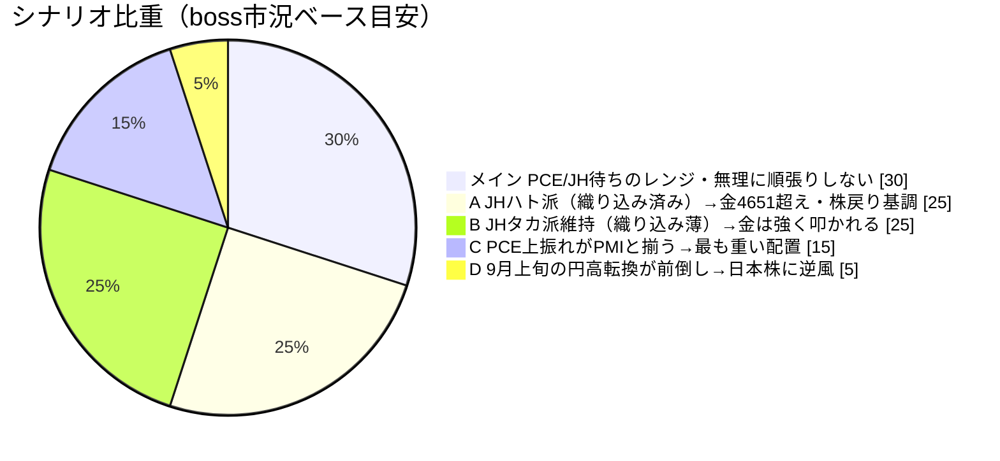
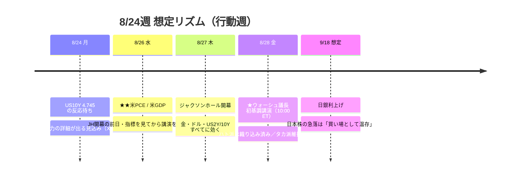

# 📌 CFD戦略ハブ — 8/24週

> [!abstract] 一行サマリー
> ★**[[ベセント]]の「長期国債の買い入れを倍のペースに」（8/20）が1日で剥落し、それが [[US10Y]]・[[USDJPY]]・[[Gold]] の矛盾したシグナルの震源になった週**。Boss の整理は「低金利→借入増→インフレ再燃→FRBが結局利上げ圧力→長期金利が戻る」という**連立方程式の破綻**で、X側は**調達側**を足す（「**財源は短期債＝疑似ツイスト**」@vkrollup／「**結局は短期債の増発**」@steve_hanke）。もう一つの軸は **AI半導体の「成長→還元」フェーズ転換**——ウォルマート決算でダウ **-1.32%** の木曜に **SOX が -0.53% で踏みとどまった**のは**サムスンが SKハイニクスに続き FCF の50%（100兆ウォン）を株主還元へ**回すと発表したため。[[Gold]] は **4,604.80（+1.90%）**・日中高値 **4,632.13** で、★**事前登録した抵抗帯 4,651.26 まで 19.13pt・[[ジャクソンホール]]まで4営業日**。[[VIX]] 15.13 で **[[Add risk gate]] 開放継続**。★★**この週の最大の成果は相場ではなくアーカイブ側**——**年輪 8-2・8-3 がともに機構として棄却された**。

> [!warning] [[レジーム]] / ゲート（at a glance）
> - 機械[[レジーム]]: **`Gold Bid` を維持したが中身が入れ替わった**（equities **flat→up** / vol=normal / oil=range / **gold=bid** / crypto **range→strong** / yields=rising）
> - [[Add risk gate]]: **開放**（[[VIX]] 14.90→**15.13** < 18）／ただし Boss は「**無理に順張りしない**」「**来週中に利確意識、深追いのロングは避ける**」
> - [[Reduce risk gate]]: **caution**（**[[US10Y]] 4.745% 上抜け** ／ **US2Y 4.24〜4.27 ブレイク** ／ **[[DXY]] 98.6 割れ** ／ **[[Gold]] 4,452 実体割れ→4,400 実体下抜け** ／ **[[US100]] 28,869 割れ** ／ **[[WTI]] 82.75 割れ** ／ **[[USDJPY]] 157.55 / 157.15 割れ**）
> - **[[為替介入]]**: `coord_stage` **executed** ／ `imf_ammo` **0** ／ zone=**calm**（158.940 < 161.0）＝**据置**
> - ★**ポジションは [[Gold]] 残 1.0 Lot**（加重平均 **4,404.50**）。**JH を 1.0 Lot で跨ぐ構えは年輪「イベント前に軽くする」と一致していない**（要Boss判断）
> - ⚠️ **wk02（2026-8-14）はスキップ**。前週比はすべて **wk01（2026-8-7）比＝2週間ぶん**

## 🔗 リンク

| 種別 | リンク |
|---|---|
| 📊 **詳細版（全グラフ・銘柄別・トリガー網羅）** | [CFD_Strategy-2026-8-24.html](./CFD_Strategy-2026-8-24.html) |
| 🧠 Rex戦略データ正本 | [[distilled-gm-2026-8]] |
| 📝 週次一次資料 | [[review]] ・ [[meta]] ・ [[2026-8-21_wk03/note\|note]] ・ [[trade_results]] |
| 🔬 **ETFルックスルー（初取得）** | [etf_lookthrough_2026-08-23](./charts/etf_lookthrough_2026-08-23.md) |
| 📉 **実質金利の実測（8-2/8-3 棄却の根拠）** | [fred_real_yield](./charts/fred_real_yield_2026-07-31_to_08-07.csv) ・ [fred_be_backfill](./charts/fred_be_backfill_2026-08-03_to_08-07.csv) |
| ⏪ 前週ハブ | [[2026-8-7_wk01/CFD戦略-2026-8-10\|wk01 ハブ (8/10週)]]（※wk02 は欠番） |
| 🌳 システムの年輪 | [2026-06-27 belly_elevated](../../../docs/system/2026-06-27_belly-elevated_rex-curve-error.md) |

## 🎯 今週の要点（3行）

1. **[[US10Y]] 4.745% が単一の最重要ライン** — 日足は昨年11月の底 3.9% から上昇トレンド継続、6月高値からの下降TLを上抜けて **4.736%** と直近レンジ上限に接近。**[[ベセント]]の買い入れ倍増策が「1日で効果消滅」した結果としての高値更新**で、★**株・為替・ゴールドの矛盾のほぼ全ての震源**。**上抜ければ株安・ドル高（円安）継続を後押し／反落すれば「来週〜9月の円高転換」シナリオの裏付け**。月曜はまずこのレベルの反応待ち。★**US2Y も 8/14終値 4.104 → 8/21終値 4.215（+11.1bp）で戻っており、handoff の「ピークアウト確定」（閾値4.154）の 6.1bp 上に復帰**——**ピークアウト宣言に無効化条件が書かれていない**点が露出した（要Boss判断）。
2. **[[Gold]] は「同じ線の上下分岐」に来ている** — **4,650 / 4,651.26 は同一の線**で、★**到達して跳ね返される＝8/6と同じ配置（最も重い抵抗帯に最大のイベントの直前）＝軽くする／終値で明確に上抜ける＝4,850圏（表示4,866.67）への新展開**。**矛盾ではなく上下の分岐**（Rex追記§K）。当週高値 **4,632.13** は **19.13pt 手前**、金曜1日で **+85.71** 動いており **JHまで4営業日**。撤退は**一次 4H 4,452 実体割れ → 二次 日足 4,400 実体下抜け（＋4H TL転換の AND）**で、★**一次は ratchet する**（新しい4H押し安値ができれば線が切り上がる）のに対し**4,400 は週足Fibo23.6 の固定水準**。
3. **[[ジャクソンホール]]の非対称は「確率」ではなく「損失」で構える** — **ハト派＝織り込み済み**（金は4,651へ、その上は空白地帯）／**タカ派維持＝織り込みが薄い**（8/21 PMI で材料が1つ乗った）→ **金は強く叩かれる**。★**確率は前者が高いが、損失の非対称が大きいので構えは後者に合わせる**。しかも★**8/26 PCE が JH開幕の前日**で、**指標を見てから講演を聞く順序**——**PCE上振れなら PMI 56.8 と方向が揃い、タカ派側の織り込みが薄いまま材料だけ2本乗る＝最も重い配置**。

## 📈 クイックビュー

## ⚠️ 監視トリガー（要点のみ／詳細はHTML）

- ★**[[US10Y]] 4.745% 上抜け** → 🔻 **株安・ドル高（円安）継続を後押し**。**今週の複合戦略で一番の注目ライン** ／ **反落なら「来週〜9月の円高転換」の裏付け**
- ★**US2Y 4.240〜4.275（チャネル上限）** → **ブレイク＝FRBタカ派再評価＝ドル買い/円安継続** ／ **反落＝レンジ継続で US10Y 反落シナリオと整合**。**[[US10Y]] とセットで見る**
- ★**8/26 [[PCE]] / GDP** → **上振れ**＝8/21 サービスPMI 56.8 と方向が揃い**タカ派側の織り込みが薄いまま材料だけ2本乗る＝最も重い配置** ／ **下振れ**＝ディスインフレ・シナリオ復元でハト派側が厚くなる
- ★**8/27-29 [[ジャクソンホール]]** → **タカ派維持で金は強く叩かれる**（織り込み薄）／ **ハト派なら 4,651 超えでその上は空白地帯**
- ★**[[Gold]] 4,452（一次・4H実体割れ）→ 4,400（二次・日足実体・全決済）** ／ 上は **4,650-4,651.26**（上抜けで **4,850圏**）。**最終防衛の滑り限界は 4,322（E2レグ0）/ 4,291（レグ全体0）**
- **[[DXY]] 98.6（日足Fibo50）** → 割れれば**節目を次々割る流れの再開**。★**8/19 に 98.772 を割った後、98.6 で止まっている**という読みが要る
- **[[US100]] 29,130〜28,869（押し目候補）／ 28,869 割れ（損切り）／ 29,691〜29,958 回復（戻り基調再開）** — ★**無理に順張りしない**。**9月上旬〜9/18 日銀利上げにかけて調整リスク＝来週中に利確意識**
- **[[JP225]] 63,640〜64,000（押し目買い）／ 65,963 上抜き定着（→66,800）** — **半導体還元銘柄の強さが下支え**。★**9/18前後のBOJ利上げ思惑での急落は「買い場」として温存**
- **[[USDJPY]] 158.00〜158.70（短期ロング・目標159.00-159.20）／ 157.55・157.15 割れ（損切り）** — ★**159.18〜159.20 超えは「騙し」の可能性で深追い禁止**。**160円超えのブレイクは今週は追わない**
- **[[WTI]] 84.90〜85.70（ロード候補・目標87.70→90）／ 88.40 超え（順張り可）／ ★82.75 割れ（制裁プレミアム剥落で撤退）** — **UAEが対イラン取引を断つなど実弾を伴う**
- **[[EURUSD]] 1.1600〜1.1646（押し目）／ 1.1575 割れでニュートラル** ／ **[[BTC]]** は**思惑買いに飛び乗らず押し目待ち**（★X側は「**準備の328k BTCは押収由来で市場買いではない**」と懐疑）

---

> [!quote] 注記
> 本ノートは **Obsidian索引（ハブ）**。全グラフ・銘柄別・口座画像は [HTML詳細版](./CFD_Strategy-2026-8-24.html)。**Rex正本は [[distilled-gm-2026-8]]**。
> データは 2026-8-21_wk03 確定値（snapshot **2026-08-23** / Boss `wr-2026-8-21`＝**本体8/21 ＋ Rex追記§A-K 8/22** / **週末終値チャート10枚** / 口座3枚＋**リバランス明細** / `--trade --news` / **X実データ（3週連続成功・`-p grok`）**）。
> ★★**年輪 8-2・8-3 がともに機構として棄却**（FRED実測・**恒等式 全34営業日で誤差ゼロ**）: **8/04 名目-7.0/BE-4.0/実質-3.0bp → 金は動かず**（DXYは99.527を割った）／**8/05 実質+1.0bp の日に金が週最大の上げ**。⚠️**ただし週内 |ΔDFII5| は最大5bp・累積-6bp で、金がパーセント単位で動く横で実質金利は bp 単位でしか動いていない**——「**実質金利は金を動かさない**」には**まだ届かない**。届いたのは「**実質金利チャネルが発生させていない動きを実質金利で説明しようとしていた**」まで。
> ★**`inflation_compensation` が snapshot 初出**（5Y BE 2.34% Δ1w**+10.0bp** / 5y5y BE 2.34% Δ1w+4.0bp。**近期が長期アンカーより大きく動き、両者が同水準に並んだ**）。**判定には使わない**（サンプル不足・閾値未設定）。
> ★**10s30s は Δ1w -3.1 / Δ30d +5.5 と窓によって符号が逆**——**引用時は必ず窓を明示**。**正本は機械の close-to-close 系列**で、Boss の手読み（暫定52.0bp・ベンダー未統一を自己申告）と**1本の時系列に混ぜない**。
> ★**金エクスポージャーは CFD（1.0 Lot・`purpose: capital`）＋ GDX（15株）＋ GXゴールド 425A（特定750口＋NISA2,000口・`purpose: hedge`）の3層で重複**。**合算して見る必要はあるが、処し方は別**（hedge はドローダウンを通す前提で原則撤退条件なし／capital は撤退条件を持つ）。**片方だけ見て判断しない。**
> ★**ETFルックスルーで診断が変わった**: **国内半導体は 200A の 8.7% のみ**で**米国半導体 2243 が 22.6% で主**／**実質エクスポージャーは米国 37.7% / 日本 62.3%**／**国内で重いのはロボ・FA 32.4%**／**2847 の電力は 0.42%**。**200A は「日経半導体株ETF」という本物の名前がついた代用品**（実体はキオクシア28.80%の3銘柄バスケット）。
> ⚠️**未確定**: US2Y は機械に存在しない（Yahooに2年指数なし）／**Boss本体「高値4.244」と TVC日足（4.217/4.215）が不一致**（§I-2）／**IONQ が米国株から消え SPCX が 10→13株**だが wk02 欠番で時期を特定できず／**リバランス明細は11件中8件のみ表示**／**GDP改定回次・PCE予想値・8/24週の他の指標は未取得**。
> ⚠️**今週の `--news` は市況材料ゼロ通過**（ウクライナ／キラキラネームの2件のみ）で **Evidence に採用していない**。
> 投資助言ではなくGM作戦整理。最終判断はミナト。生成: ClaudeCode / 2026-08-23。
