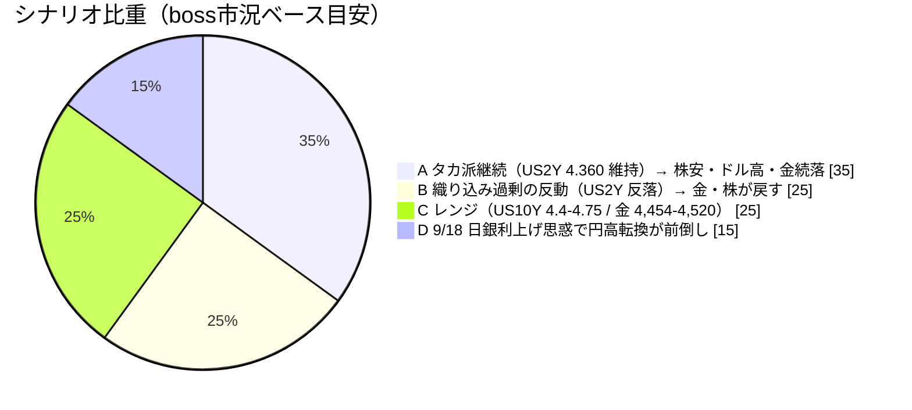
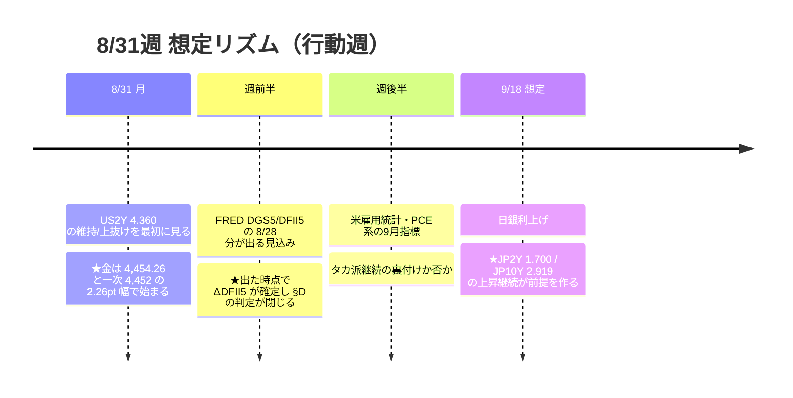

# 📌 CFD戦略ハブ — 8/31週

> [!abstract] 一行サマリー
> ★★**8/28(金)23:00 JST、ウォーシュ議長の[[ジャクソンホール]]講演がタカ派だった。それが週のすべてを決めた。**「基調的なインフレが目標に向かって明確かつ十分な速さで進んでいると確信できなければ、**まだやるべき仕事がある**」「**65ヶ月続く高インフレの責任は中銀自身にある**」——**9月利上げ確率は CME FedWatch で約35% → 57〜60% へ急上昇**し、市場は典型的な**「ベアフラットニング＋ドル高・逆金融相場」**で反応した。**US2Y 4.360%（週間 +14.5bp）／[[US10Y]] 4.730%（-0.6bp）／US30Y 5.213%（-4.3bp）＝短期だけが上がり長期はむしろ下がった**。[[Gold]] は **4,454.26（-3.21%／週間 -3.27%）**、[[DXY]] **99.677（+0.55%）**、[[USDJPY]] **160.079**。★★**8/7 に登録した「ブルスティープ転換点」は3週間で無効化**（⚠️ただし遡って書き換えない）。[[VIX]] 14.510 で **[[Add risk gate]] は開放継続**だが、**骨格は逆金融相場**。★**本アーカイブ初の日本国債実測**（JP2Y 1.700% / JP10Y 2.919%）。

> [!warning] [[レジーム]] / ゲート（at a glance）
> - 機械[[レジーム]]: **`Gold Bid`**（volatility=normal / oil=range / **gold=bid** / crypto=strong）。⚠️★**`equities=flat` と `relative_strength.verdict=mixed` は US100 の NaN が誤ったラベルに化けた産物なので本週は読まない**
> - [[Add risk gate]]: **開放**（[[VIX]] 15.13→**14.51** < 18）／ただし★**金利レジームがベアフラットへ再反転しており、無理に順張りしない**
> - [[Reduce risk gate]]: **caution**（**US2Y 4.360 維持/上抜け** ／ **[[US10Y]] 4.745 突破** ／ **[[Gold]] 4,454.26 割れ→4,452 実体割れ→4,400 実体下抜け** ／ **[[US100]] 29,466 割れ** ／ **[[JP225]] 65,634〜65,684 割れ** ／ **[[USDJPY]] 160.50〜160.55（口先介入ゾーン）** ／ **[[WTI]] 82.749 割れ** ／ **[[EURUSD]] 1.15749 割れ**）
> - **[[為替介入]]**: `coord_stage` **executed** ／ `imf_ammo` **0** ／ zone=**calm**（160.038 < 161.0）。⚠️★**Boss の口先介入ゾーン 160.50〜160.55 は機械の watch_zone 161.0 より低く、警戒線まで 0.42〜0.47 円しかない**
> - ★★**ポジションは [[Gold]] 残 1.0 Lot で確定**（加重平均 **4,404.50**・Boss確認 2026-08-29）。「**4,500水準の4H実体下抜け確定 → 半値撤退**」の条件は**金曜に成立していたが執行していない**。**週明けの発動条件は trade_results §5 に更新済み**
> - ★**US2Y ピークアウト宣言を本週次で撤回**——閾値 4.154% に対し **8/28終値 4.360%＝+20.6bp**。無効化条件（日足 4.230 圏を日足実体で回復）は **2026-08-22 提案**（`wr-2026-8-21.md` §E）→ **2026-08-23 登録**で、**当週に完全に達成された**。★**置いていたからこそきれいに撤回できた**
> - ⚠️★★**本週は米金利について Boss 実測（8/28終値）が正本**——Yahoo の 8/28 欠測で**機械の金利4本は 8/27＝ウォーシュ講演の前**であり、**本週の最大イベントを1本も織り込んでいない**

## 🔗 リンク

| 種別 | リンク |
|---|---|
| 📊 **詳細版（全グラフ・銘柄別・トリガー網羅）** | [CFD_Strategy-2026-8-31.html](./CFD_Strategy-2026-8-31.html) |
| 🧠 Rex戦略データ正本 | [[distilled-gm-2026-8]] |
| 📝 週次一次資料 | [[review]] ・ [[meta]] ・ [[2026-8-28_wk04/note\|note]] ・ [[trade_results]] |
| 📉 **--trade 実測＋データ整合の全記録** | [2026-07-31 〜 2026-08-30](./charts/2026-07-31%20%E3%80%9C%202026-08-30.txt) |
| 📰 市況＋news＋X統合 | [Market conditions -2026-8-28~](./charts/Market%20conditions%20-2026-8-28~.txt) |
| ⏪ 前週ハブ | [[2026-8-21_wk03/CFD戦略-2026-8-24\|wk03 ハブ (8/24週)]] |
| 🌳 システムの年輪 | [2026-06-27 belly_elevated](../../../docs/system/2026-06-27_belly-elevated_rex-curve-error.md) |

## 🎯 今週の要点（3行）

1. **金利レジームが完全に反転した — これが他のすべての上流** — **US2Y 4.215→4.360%（+14.5bp）／[[US10Y]] 4.736→4.730%（-0.6bp）／US30Y 5.256→5.213%（-4.3bp）**。カーブは **2s10s 52.1→37.0bp（-15.1bp）／2s30s 104.1→85.3bp（-18.8bp）**＝★**短期だけが上がり長期はむしろ下がった**。★**US30Y がほぼ横ばいだったことが「タカ派だが将来のインフレ抑制期待も同時に織り込まれた」という市場の解釈を示す**（Boss）。**週明けは US2Y が 4.360% を維持・上抜けするかが「タカ派継続」を裏付けるバロメーター**、**[[US10Y]] は 4.745% 突破なら一段高・失敗なら 4.4〜4.75% のレンジ継続**。★★**8/7 の「ブルスティープ転換点」は3週間で無効化されたが、8/7〜8/21 は実際にその形だったので遡って書き換えない**——**新しい日付の追記としてレジームが再反転したと記録する**。
2. **[[Gold]] は 4,660 で弾かれて 4,454 まで落ちた — 一次シグナルまで 2.26pt** — **8/25-26 に高値 4,673.78 を付け、週足Fibo23.6（4,660.71）を上抜けて跳ね返され**、そこから **-219.52pt** を返した。★**8/6 の「最も重い抵抗帯に最大のイベントの直前で到達 → 跳ね返される」と同型で n=2**。★★**週末終値 4,454.26 は一次シグナル 4,452 のわずか 2.26pt 上**——**極めて近い**。撤退設計は **一次 4H 4,452 実体割れ（2026-08-23 に固定・ratchet しない）→ 二次 日足 4,400 実体下抜け＋4H TL転換の AND**。戻りの壁は **4,519.97 / 4,660.71**。
3. **事前登録は的中したのに、何も起きなかった** — 2026-08-20 handoff §5 の「**タカ派維持 → 織り込み薄 → 金は強く叩かれる**」は**低確率側で的中**し、「4,651.26 に JH 前に到達したら 8/6 と完全に同じ配置」という**配置の認識まで再現**した。★★**にもかかわらず事前登録に「行動」が書かれていなかったため、発火しても何も起きなかった**。→ **登録テンプレートに `trigger` / `action` / `invalidation` の3欄を必須化する提案**（trade_results §4）。★**正しい判断が執行につながらなかった記録として残す**。

## 📈 クイックビュー

## ⚠️ 監視トリガー（要点のみ／詳細はHTML）

- ★★**US2Y 4.360%（維持/上抜け）** → **「タカ派継続」の裏付け＝株安・ドル高継続**。**今週の単一の最重要ライン**（Boss）／ **維持できず反落＝タカ派の織り込み過剰**
- ★**[[US10Y]] 4.745% 突破** → **一段高** ／ **失敗なら 4.4〜4.75% のレンジ継続**
- ★★**[[Gold]] 4,454.26（第一関門）** → 割れれば **4,410.15 → 4,330台の移動平均線密集ゾーン**。★**一次シグナルは 4H 4,452 実体割れで固定**（2026-08-23 確定・ratchet しない）→ **二次は日足 4,400 実体下抜け＋4H TL転換の AND**。戻りの壁は **4,519.97 → 4,660.71**（★**当週跳ね返された線・n=2**）
- ★**[[US100]] 29,466（終値割れ）** → **29,320 方向**。9月はAIデータセンター計画の遅延・中止懸念 ／ **29,644〜29,935 を回復すれば上値の重さが解ける**。★**金曜だけ見ると下落だが週間では3指数ともプラス（NVIDIA決算効果）**——**混同しない**
- ★**[[JP225]] 65,634〜65,684（生命線）** → 割れで **60,488 方向**。★**米金利上昇・ドル高は日本株には逆風材料が増えた**
- ★★**[[USDJPY]] 160.50〜160.55（口先介入リスクゾーン）** → 機械は `calm`（watch_zone 161.0）だが **Boss の警戒線まで 0.42〜0.47 円**。上は **160.508 の壁**、下は **159.620 / 159.0**
- **[[EURUSD]] 1.15749 割れ**（下値余地拡大）／ **1.16687〜1.16602 回復**（戻りの目安）
- **[[WTI]] 82.749〜82.895（下限）／ 86.167（上限）** — ⚠️★**イラン制裁の拡大（--news ③）とホルムズ通航量の半分回復が同時進行＝両方向の材料**
- **[[DXY]] 100.335 / 99.430 / 98.687** — ★**8/19-20 に割った 99.430 を回復してその上で引けた**
- **[[BTC]] 75,200〜78,000 帯で下げ止まるか** — 止まれば量子耐性という中期材料が効いてくる分岐点
- ★**日本金利 JP2Y 1.700% / JP10Y 2.919%** — 上昇継続なら **9/18 [[日銀利上げ]] → 円高転換**。⚠️**X側は9月利上げ確率80〜90%（未検証）とし、Boss の「明言回避＝ハト派寄り」と読みが割れる**

---

> [!quote] 注記
> 本ノートは **Obsidian索引（ハブ）**。全グラフ・銘柄別・口座画像は [HTML詳細版](./CFD_Strategy-2026-8-31.html)。**Rex正本は [[distilled-gm-2026-8]]**。
> データは 2026-8-28_wk04 確定値（snapshot **2026-08-30** / Boss `wr-2026-8-28`＝**本体8/28 ＋ Rex追記 2026-08-29** / **週末終値チャート11枚**（★**JP2Y・JP10Y を含む**）/ 口座3枚 / `--trade --news` / **X実データ**）。
> ★★**本週の特例（Boss指示 2026-08-30）**: **米金利は添付の終値チャートとレポート記載内容を1次情報として判断する**。理由は **Yahoo 側で 8/28 の金利4本が行ごと欠測**し、**機械の金利値が 8/27＝ウォーシュ講演の前**だったため。機械の `yields` ラベル・`curve_spreads` は**日付注記付きの副次記録**として残すだけで判断には使わない。
> ★★**NaN が「欠損」ではなく【誤ったラベル】に化けていた**——`regime.equities=flat` / `relative_strength.verdict=mixed` はいずれも **NaN が比較を全てすり抜けて終端の `return` に落ちた産物**。★**【Boss訂正 2026-08-29】これは上の2関数だけの問題ではなく、末尾に無条件 `return` を持つ判定関数はすべて同じ穴を持つ**。→ **監査範囲は「終端フォールバックを持つ判定関数の悉皆」**、**是正は「各判定関数に NaN を食わせて `unknown` が返ることを確認するテストを1本書く」**（関数ごとに if を足す対症療法にしない）。→ **要Boss判断**。
> ★★**機械 `bull_flattening` vs Boss「ベアフラットニング」は、front の選び方の差ではない**（**Boss訂正 2026-08-29**）——**3M は政策金利そのものに貼り付いており、利上げ確率の織り込みという情報を構造的に持たない**ため、**利上げ観測でフロントが売られる局面では機械は必ず `bull_flattening` を出し続ける**。**指標設計に由来する系統的バイアス＝指標の側の問題**。是正は **A: front を 2Y（FRED `DGS2`）に替える** / **B: 両方持ち 3M系ラベルに「政策期待の判断には使えない」と用途制限を明記** の二択 → **要Boss判断**。**2026-06-27 の年輪の同型の再発だが一段深い**（当時は「代理が届かない」、今回は「**代理が特定の局面で必ず一方向に誤る**」）。
> ★**§D（DFII5 の検定）は【判定保留】**。★**「取得窓が狭いだけでは」を FRED の生CSVで潰した**——**DGS5 は 8/27 4.38、DFII5 は 8/27 2.07 で終わっており 8/28 の行そのものが存在しない**（値が空欄なのではない）。**T5YIE だけ 8/28 = 2.30 がある**＝**H.15 と breakeven の公表タイミング差**。★**ただし ΔT5YIE(8/27→8/28) = -1.0bp から、恒等式 `T5YIE = DGS5 - DFII5` より ΔDFII5 = ΔDGS5 + 1.0bp まで確定**——**未知数は ΔDGS5 だけ**。**記録として: BE は 8/28 に日次で低下した**＝恒等式上「実質が名目より 1.0bp 多く上昇した」と同値。⚠️ただし **1bp は測定分解能そのもの**（年輪§8「測定分解能より細かい閾値」）で**方向の主張には使わない**。
> ★**インフレ補償（FRED・as_of 8/28）**: 5Y BE **2.30%（Δ1w -4.0bp）** / 5y5y BE **2.32%（Δ1w -2.0bp）**＝**両方 narrowing**。**wk03 は両方 widening だったので方向が反転**。
> ⚠️ **XAUUSD・DXY・USDJPY・WTI・US100 は Pepperstone / TVC / BlackBull / Capital.com / FOREX.com の混在**（Rex追記§H）。**1本の系列に混ぜない**（年輪§8(e)）。
> ⚠️ **X上の数値**（利上げ確率 55-59% / Kalshi 43-48% / 日銀 80-90% / 介入15.4兆円 / NVDA $96.2B・EPS $2.22）は**すべて未突合**。
> ⚠️**未確認の持ち越し**: **2243・1655 の為替ヘッジ有無（3週連続）** ／ **SPCX の取引履歴・IONQ 消滅の経緯** ／ **5/11 に 1627 を売却した理由** ／ **P9・P10 の登録可否と「発言日」の定義**。
> 投資助言ではなくGM作戦整理。最終判断はミナト。生成: ClaudeCode / 2026-08-30。
