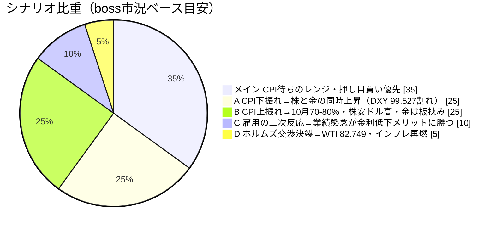
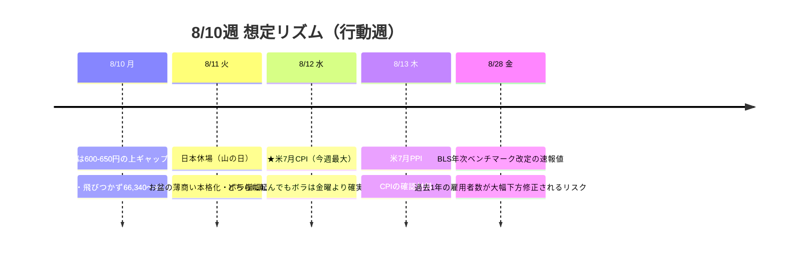

# 📌 CFD戦略ハブ — 8/10週

> [!abstract] 一行サマリー
> ★**8/7 [[NFP]] -23,000人**（予想+83,000）が週の意味をすべて決めた。**5-6月合計-103,000の下方修正**、失業率4.2%→4.1%は**労働参加率61.5%→61.4%（5年超ぶり低水準）**による**質の悪い改善**、平均時給+3.2%でインフレ残存＝**スタグフレーション型**でFRBは「**conundrum（板挟み）**」。★**肝は「利上げ否定」でなく「先送り」** — **9月42%**（50%割れ）だが**10月まで57%超**、**[[US2Y]]は日中安値4.154%→引けにかけ4.199%まで+4.5bp買い戻し**＝**市場は金利低下を最後まで追いかけなかった**。[[Gold]]は**週次+7.20%**で現物4,342.41・高値4,370.49の**7週間ぶり高値圏**、**[[SP500]]は8/6に史上最高値**、一方**[[WTI]]だけ別ドライバーで週間-8.96%**（ホルムズ再開交渉＝**TACOリスク顕在化**）。[[VIX]] 14.90で**[[Add risk gate]]開放継続**。★**[[Gold]] CFDは8/7に全決済しフラット** — 6/12からの**57日キャンペーンが確定6件・6勝0敗・+505.75 pt·Lot（+21.06%）で終了**。

> [!warning] [[レジーム]] / ゲート（at a glance）
> - 機械[[レジーム]]: **`Gold Bid`**（equities=**flat** / vol=normal / oil=**range** / **gold=bid** / crypto=range / yields=rising）← wk05「Equities Down / Oil Surge」から**3項目が同時に転換**（**gold は off→bid の2段階改善**）
> - [[Add risk gate]]: **開放**（[[VIX]] 15.99→**14.90** < 18）／ただし「**CPI待ちの一時的な安心感**」＝**8/12 CPIがスイッチ**。**8/11(火)は日本が山の日で休場**＝お盆の薄商いでボラ増幅
> - [[Reduce risk gate]]: **caution**（**US2Y 4.256%超え** ／ **US100 29,560割れ** ／ **[[Gold]] 4,302.18割れ** ／ **[[WTI]] 76.705割れ or 82.749戻し** ／ **[[USDJPY]] 156.589割れ** ／ **CPI上振れで10月利上げ確率70-80%へ**）
> - **[[為替介入]]**: `coord_stage` **executed** ／ `imf_ammo` **0**（据置）。★**NFP後もドル円がほぼ無風の157.78＝介入効果の剥落**が鮮明（163→155の値幅の**半分近くを既に戻した**）
> - ★**ポジションは[[Gold]]含め全てフラット＝ヘッジ枠ゼロ**。再構築は**4,302.18を上抜けサポートとして守れる確認後**

## 🔗 リンク

| 種別 | リンク |
|---|---|
| 📊 **詳細版（全グラフ・銘柄別・トリガー網羅）** | [CFD_Strategy-2026-8-10.html](./CFD_Strategy-2026-8-10.html) |
| 🧠 Rex戦略データ正本 | [[distilled-gm-2026-8]] |
| 📝 週次一次資料 | [[review]] ・ [[meta]] ・ [[2026-8-7_wk01/note\|note]] ・ [[trade_results]] |
| 🏆 **キャンペーン全記録（6/12→8/7・全期間reconciled）** | [Gold-2026-06-12_to_08-07](../../boss's-trade-Report/Gold-2026-06-12_to_08-07%20.md) |
| ⏪ 前週ハブ | [[2026-7-31_wk05/CFD戦略-2026-8-3\|wk05 ハブ (8/3週)]] |
| 🌳 システムの年輪 | [2026-06-27 belly_elevated](../../../docs/system/2026-06-27_belly-elevated_rex-curve-error.md) |

## 🎯 今週の要点（3行）

1. **[[NFP]]は「利上げを否定した」のではなく「9月から10月以降へ後ろ倒しした」だけ** — **9月42%／10月57%超**で**過半数は依然利上げを見込む**。裏付けが債券の値動きで、**[[US2Y]]は日中安値4.154%まで急低下した後、引けにかけて4.199%まで4.5bp買い戻された**（[[US10Y]]も4.639→**4.649**）。★**市場は金利低下を最後まで追いかけなかった**、というのが金曜の本質。**US2Yの4.154%を割るか、4.256%を超えるかが今週すべての起点**。カーブは **3m10s +106.3→+95.0bp**・**belly_premium +26.0→+18.9bp** ＝ **再利上げ織り込みの瘤が萎んだ**ことと整合。
2. **[[Gold]]は買われる理由が3層あるが、試金石は 4,302.18 の一点** — **スタグフレーション懸念（金の最も好きな環境）＋ドル安（[[DXY]] 99.604＝6週ぶり安値圏）＋ホルムズ再開に伴う原油下落**（金は原油と逆相関で推移してきた）＋中銀の継続買い。★**ただし1/29の史上最高値5,585-5,589から依然20%以上下＝日足の大きな下降チャネル内の戻り**。**4,302.18（旧抵抗）を上抜けサポートとして機能させられるかを確認しつつ押し目買い、割れれば「一日限りの過剰反応」と判断して4,248まで撤退**。★**上値追随の条件は DXY 99.527割れ かつ BEが崩れないこと**（ドル安だけでは足りない／§8-2）。※**2026-08-09 訂正**: 当初この第2条件を「10s30s拡大」としていたが、§8-2 の実測根拠は**取得時刻が揃っておらず時系列として無効**と判明（機械の close-to-close 系列では**金が週最大の上げを見せた 8/5 に 10s30s は縮小**＝逆）。→ **10s30s は条件から外し、未検証の仮説として観察のみ**。
3. **[[USDJPY]]がNFP後もほぼ無風だったことが今週一番の注目点** — 米金利が低下し[[DXY]]が売られたのに**157.78でほとんど動かなかった**。理由は①**失業率は逆に4.1%へ低下** ②**利上げは否定されず10月に先送りされただけ** ③**円側の要因（財政拡張・日銀の遅れ）が重く介入効果が剥落中**。ベッセント『**介入はシグナル、方向を変えるのは政策**』、PGIM『**介入だけで円安トレンドは反転しない、むしろ裏目に出る可能性**』。**157.0〜158.5のレンジ**で往復、**156.589割れで介入警戒モードに切替**。

## 📈 クイックビュー

## ⚠️ 監視トリガー（要点のみ／詳細はHTML）

- ★**[[US2Y]] 4.154% 割れ / 4.256% 超え** → **今週すべての起点**。割れ＝利上げ観測の一段後退（株・金に追い風）／超え＝**利上げ観測復活でカーブ再フラット化＝株と金にダブルパンチ**
- ★**8/12 [[CPI]]** → **強ければ**10月利上げ確率70-80%へ＝🔻株安・ドル高・**金は「インフレヘッジ」と「利上げ警戒」で板挟み** ／ **弱ければ**利上げ観測ほぼ消滅＝🟢株・金の同時上昇・[[EURUSD]] 1.16
- ★**[[Gold]] 4,302.18** → 上抜けサポートとして守れれば押し目買い、**割れれば4,248.25まで撤退**（→4,216.34）。上は4,370.49→4,380.85→4,400。**最終防衛 $3,940（2026-08-08以降の新基準・実運用検証は未実施）**
- ★**[[DXY]] 99.527** → **全通貨ペア共通のトリガー**（現値99.604＝**0.08の距離**／8/7当日は99.422まで）。割れ＝ドル全面安の継続で金・[[EURUSD]]に追い風
- **[[USDJPY]] 156.589 割れ** → 🔻 **介入警戒モードに切替**（→155.7）／ **158.50-158.56 上抜け** → 159.20-159.50の戻り売りゾーン＝**円安復帰**
- **[[WTI]] 76.705 割れ**（重要／割れると加速）→ 74.899→70.00 ／ **82.749 戻し** → 🔻 インフレ再燃。★**ヘッドライン主導の二極化＝持ってもポジションは軽く**。X市況の懐疑「**紙の価格は織り込んだが、海（実物流）はまだ戻っていない**」
- **[[US100]] 29,560〜29,600（上抜けたサポート）** → 上 29,870→30,000→30,922 ／ **29,560割れで初めて「ダマシ」を疑う**。★X市況は「**乗りつつも天井感を意識する二層構造**」＝**追いかけ買いはしない**
- **[[JP225]] 押し目66,340〜66,000 / 上 67,353→67,596** — **CFD夜間66,248で月曜は600-650円の上ギャップ想定**だが**ギャップアップ後の寄り天は日経の典型**。66,000割れでギャップ埋め＝65,606（金曜現物終値）。**ドル円が円高に進んでいないことが追い風の維持条件**
- **[[BTC]] 64,132 割れ → 57,744** → 条件成立まで待つ。**株高＋金急騰の中で動かなかった相対的弱さ**は継続監視
- **8/28 BLS年次ベンチマーク改定** → 過去1年の雇用者数が大幅下方修正されるリスク

---

> [!quote] 注記
> 本ノートは **Obsidian索引（ハブ）**。全グラフ・銘柄別・口座画像は [HTML詳細版](./CFD_Strategy-2026-8-10.html)。**Rex正本は [[distilled-gm-2026-8]]**（8月分を新規作成）。データは 2026-8-7_wk01 確定値（snapshot 2026-08-08 / Boss wr-2026-8-7 / **週末終値チャート10枚**（US100/JP225/USDJPY/EURUSD/DXY/XAUUSD/WTI/**US30Y**/US10Y/US2Y）/ 口座3枚 / --trade --news / **X実データ（2週連続で取得成功・`-p grok`）**）＋**Boss専用トレードレポート**（6/12→8/7の全期間reconciled）。★**キャンペーン終了**: 確定6件・**6勝0敗**・**+505.75 pt·Lot（+21.06%）**、最大逆行-76.7 pt·Lot、**三相＝I.収穫(6/12-6/29)／II.耐久(7/1-7/31)／III.回収(8/1-8/7)**。★**6件の決済すべてが価格目標でなく「根拠の状態変化」をトリガー**にしており、特に**X5は「実行帯到達＋根拠が当事者に否定された」＝根拠の質の劣化**で発火。★**設計変更**: トレードレポート§7-3の指摘（**wk05のシナリオツリーに反対方向の分岐がなくUS100レンジ想定が29,112まで破られた**）を受け、**本週から主要リスクごとに反対方向の分岐を明示**。★**未確定**: §3-1 E2建値 $3,992 vs $3,990 は約定履歴未確認のため**確定させていない**。★**拡張候補（ボス検討中）**: §8-2 の **10s30s**（実測+55.3bp）を金の補完監視線にするには `TRADE_PAIRS` へ **`US30Y: ^TYX`** の追加が必要で、**今週は未実装**。WTIは機械(CL=F 78.180)とBoss参照フィード(77.08)に**既知の乖離**あり。X上の各ポストは**市場参加者の解釈であり1次報道ではない**。投資助言ではなくGM作戦整理。最終判断はミナト。生成: ClaudeCode / 2026-08-08。
</content>
