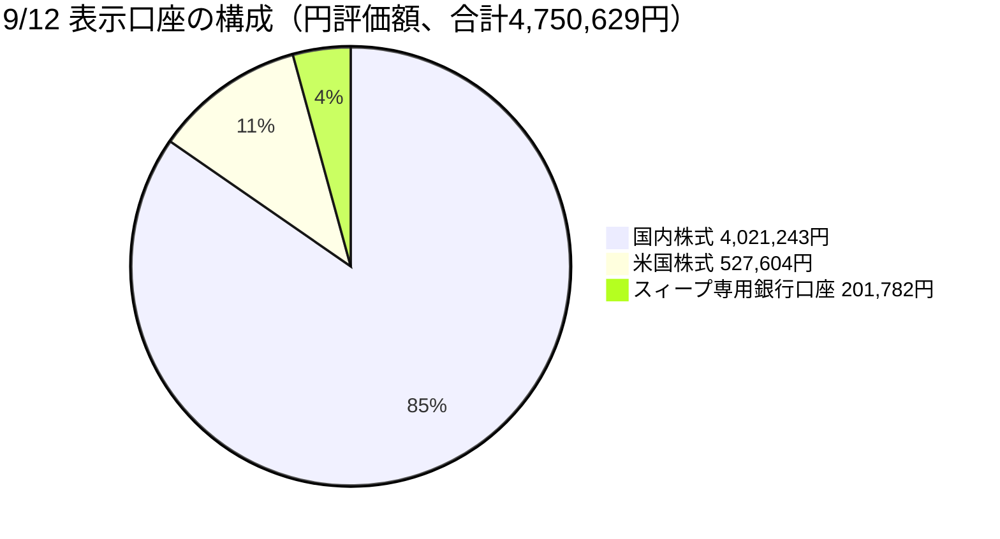
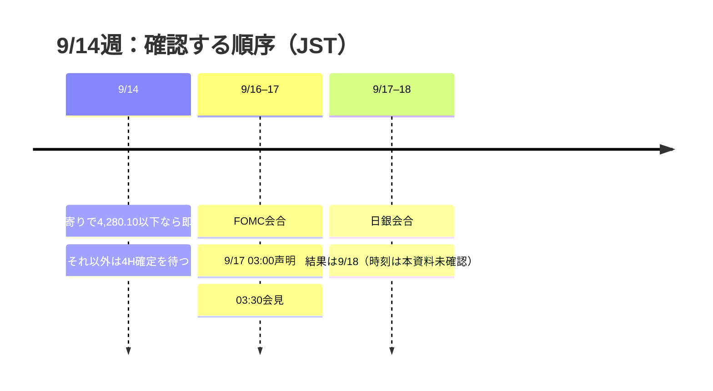

# CFD戦略ハブ — 9/14週（草案）

> [!warning] **関所7.5承認待ち。発注指示ではない。**
> 本書は週末確定値から作った人間用ビューであり、正本は [[distilled-gm-2026-9]]。承認前に新規CFD、増し玉、自動再エントリーを指示しない。

## リンク

| 種別 | 参照 |
|---|---|
| 詳細版（ネットなしで閲覧可） | [CFD_Strategy-2026-9-14.html](./CFD_Strategy-2026-9-14.html) |
| 当週の執行正本 | [trade_results](./trade_results.md) |
| 当週の一次整理 | [review](./review.md) ・ [meta](./meta.yaml) ・ [note](./note.md) |
| 検証・根拠・運用計測 | [sources](./sources.md) ・ [quality gate](./quality_gate.md) ・ [pilot run](./pilot_run.md) |
| Rex戦略データ正本 | [distilled-gm-2026-9](../../../../distilled/2026/distilled-gm-2026-9.md) |
| 前週ハブ | [9/7週](../2026-9-4_wk01/CFD戦略-2026-9-7.md) |
| 翌週ハブ | **未作成** |
| 30日スナップショット | [2026_09_12_snapshot.yaml](./charts/2026_09_12_snapshot.yaml) |

## 今週の要点

1. [[レジーム]]は **Gold Bid → Equities Down / Oil Surge**。金曜の米株反発・[[VIX]]低下は、この30日観測と両立し得る反証材料であり、単純な反転確定ではない。
2. [[Gold]]の現行管理対象は残 **0.5 Lot @4,330.23**。[[Reduce risk gate]] はcautionで、4H実体が **4,319.13–4,306.50** と週足下降ラインを下抜けた時のみ撤退、9/14寄りで **4,280.10以下**なら待たずに撤退。4H未確定の下ヒゲだけでは常時撤退しない。
3. 9/17早朝JSTの[[FOMC]]と9/18の[[日銀利上げ]]結果まで、新規方向性リスクの追加を抑える。[[Add risk gate]] はopenだが、[[VIX]] < 18は許可条件の一つであって、積み増し命令ではない。

## クイックビュー

## 8系列・30日観測と週次の金利確認

| 系列 | 30日終値 / 変化 | 今週の用途 | ソースと留保 |
|---|---:|---|---|
| [[USDJPY]] | 153.554 / -3.62% | 円高の観測 | 機械スナップショット。執行FXCM終値153.468とは混用しない。 |
| [[US100]] | 29,368.439 / -2.38% | 株式の30日弱含み | 機械スナップショット。CFD終値29,371.2は別表記。 |
| [[JP225]] | 64,011.340 / -6.29% | 日本株の30日弱含み | 9/11現物公式値。CFD64,686を月曜ギャップ幅にしない。 |
| [[Gold]] proxy | 4,366.200 / +0.06% | 金の30日横ばい圏 | 機械proxy。Pepperstone執行終値4,348.33を優先。 |
| [[WTI]] | 100.050 / +23.14% | 原油急騰の観測 | 30日機械futures。執行価格の代用ではない。 |
| US2Y | **30日数値未提示** | 金利の週次確認 | TVC 4.630%、前週4.374%で **+25.6bp**。`^FVX`を代用しない。 |
| [[US10Y]] | 4.975 / +7.20%* | 長期金利の30日観測 | *利回り水準の相対変化。TVC週次は4.969%、前週4.784%で+18.5bp。 |
| [[VIX]] | 15.840 / +8.27% | リスク許可の補助条件 | 週次比較に前週の別ソース14.530を混ぜない。 |

米2s10sは **41.0→33.9bp（-7.1bp、ベアフラット）**、日本2s10sは **108.5→114.5bp（+6.0bp、スティープ）**。日米2年差は+24.1bpへ拡大した一方で円高が同居した。金利差だけで[[USDJPY]]を説明する仮説には反例方向の観測であり、正式な棄却条件の変更は未承認である。

## 当週のGold CFD：確定と残玉

| 決済 | 計算 | pt·Lot |
|---|---|---:|
| 9/7 15:00・0.5 @4,311 → 4,396 | 85.00 × 0.5 | +42.500 |
| 9/9 16:30・1.0 @4,315 → 4,345 | 30.00 × 1.0 | +30.000 |
| 9/11 23:17・0.5 @4,330.23 → 4,378 | 47.77 × 0.5 | +23.885 |
| **当週確定 3勝0敗** |  | **+96.385** |

残玉は **0.5 Lot @4,330.23**、4,348.33評価で **+9.050 pt·Lot**。旧キャンペーン+129.000、9/2キャンペーン+190.000、新々キャンペーンの確定+53.885と残玉評価を合わせた通算は **+381.935 pt·Lot**。貨幣換算単位は未確認のため、pt·Lotのまま記録する。

| 仮定約定 | 残玉PnL | 9/9キャンペーン計 | 通算 |
|---:|---:|---:|---:|
| 4,348.33 | +9.050 | +62.935 | +381.935 |
| 4,319.13 | -5.550 | +48.335 | +367.335 |
| 4,306.50 | -11.865 | +42.020 | +361.020 |
| 4,280.10 | -25.065 | +28.820 | +347.820 |
| 4,260.00 | -35.115 | +18.770 | +337.770 |

4,280.10は最終**判断**水準、4,260.00はスプレッド等を考慮した逆指値の**執行**位置であり、別の撤退判断ではない。9/7の4,400条件は事前変更後に4396で退出したものなので、旧4,280基準への違反としては扱わない。

## ポートフォリオ（12行、9/12表示）

> 総資産4,750,629円（前週4,906,965円、-156,336円）。うち50,000円はスィープ専用銀行口座から銀行口座へ移動済み。移動を戻した比較可能額4,800,629円は前週比 **-106,336円**で、国内株-100,538円と米国株-5,798円に一致する。正式TWRではない。

| 区分 | 銘柄 | 数量 | 現在単価 | 評価額円 | 評価損益円 | 前週差円 |
|---|---|---:|---:|---:|---:|---:|
| 特定 | 200A | 91 | 4,198 | 382,018 | -10,738 | -10,101 |
| 特定 | 425A | 750 | 358.1 | 268,575 | -3,675 | -11,475 |
| 特定 | 586A | 50 | 245.5 | 12,275 | +1,525 | -375 |
| 特定 | 6954 | 100 | 5,735 | 573,500 | -47,000 | -19,600 |
| 特定 | 7011 | 100 | 3,705 | 370,500 | -17,500 | -4,900 |
| NISA | 1655 | 270 | 846.2 | 228,474 | +19,494 | -7,128 |
| NISA | 2243 | 174 | 4,259 | 741,066 | +274,746 | +2,610 |
| NISA | 2638 | 193 | 2,555 | 493,115 | +30,880 | -14,089 |
| NISA | 2847 | 80 | 2,944 | 235,520 | +23,360 | -4,880 |
| NISA | 425A | 2,000 | 358.1 | 716,200 | -71,800 | -30,600 |
| US | GDX | 15 | 97.10 USD | 224,548 | +22,633 | -8,196 |
| US | SPCX | 13 | 151.21 USD | 303,056 | -7,020 | +2,398 |

425Aは特定750口とNISA2,000口を別管理する（計2,750口、週差-42,075円）。GDXと425Aは金関連だが、金ETFと金鉱株は同じリスクではない。把握済みUSD原資産は1655・2243・米国2銘柄を合わせ1,497,144円相当だが、全外貨リスク総額ではない。分類は重複するため合計しない。

## 対立シナリオと未確認

| 観測 | 読み方A | 対立する読み方B / 未確認 |
|---|---|---|
| 金曜の米株反発・VIX低下 | リスク懸念の緩和 | イベント通過後のポジション調整に過ぎず、30日株安と両立する。 |
| WTIの30日+23.14%と金曜反落 | 地政学リスクの変化 | 原油安だけで地政学解消とは結論できない。公式一次本文・再開状況は未確認。 |
| 米2Y上昇と円高 | 金利差単独仮説の反例 | 為替の原因を一要因に固定しない。P11の正式棄却条件は変更しない。 |
| 日銀会合 | 利上げなら金融株に利鞘改善 | 債券損失・景気悪化も競合。金融/内需を一括で断定しない。 |

## ソースを分けて読む

- **Boss確定・執行**: `trade_results.md`、提供Pepperstone/FXCM/CFDチャート、口座3画像。
- **機械スナップショット**: 2026-09-12 15:16 JSTに1回取得。通常系列は9/11 aligned、BTCは9/10で別窓。BTC 77,262.47は9/12進行バーの週末参考で、9/11確定終値ではない。
- **一次資料で確認済み**: BLS CPI（総合MoM0.4・YoY3.4、コアMoM0.3・YoY2.4）、Michigan速報47.8、日経現物9/11の64,011.34、FOMC/日銀の日程。
- **未確認・推定を混ぜない**: **FOMC 85%超・日銀98%**はそれぞれBoss原本の市場推定であり、独立未確認。Fiboラベル、全約定の開始時刻、MAE実測、地政学の一次本文は未確定。

本草案は関所7.5で一次資料との整合と、実測外の混入がないことを確認してから承認対象にする。発注・自動執行は承認対象外であり、**Gitへの記録・公開は関所7.5承認後**とする。
