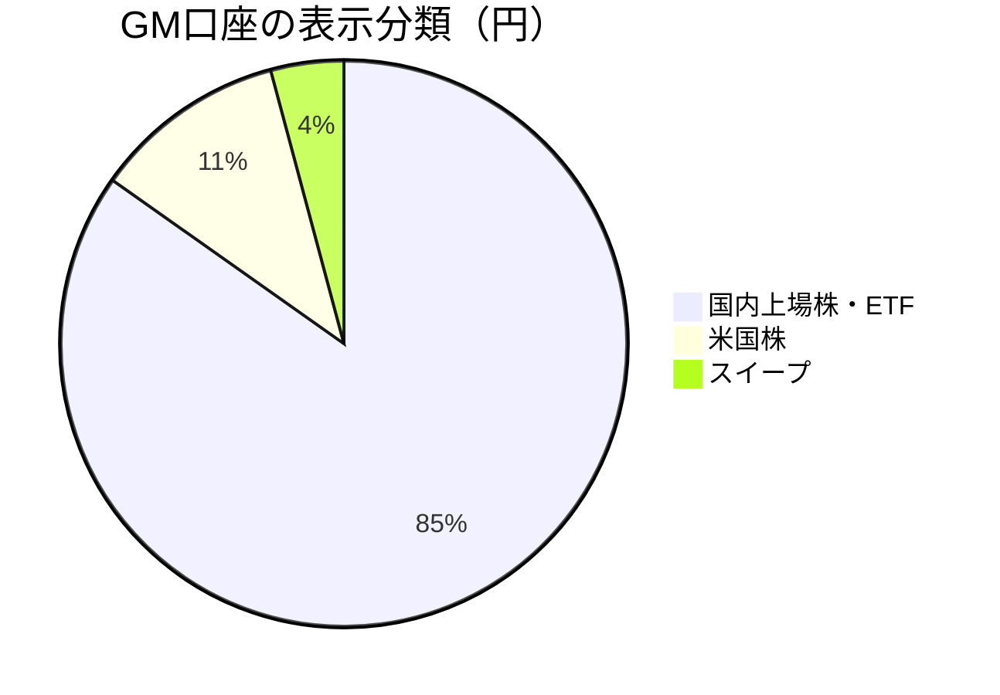
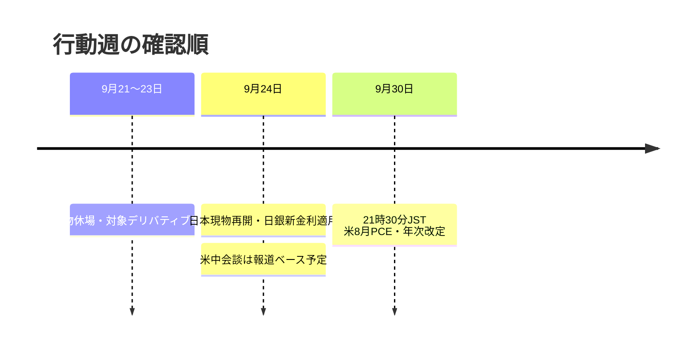

# CFD戦略 — 2026/9/21週

**株・BTCは支持確認、原油と米金利の再加速には防御。**

1. Goldは1 Lot・stop4,230。実現+50、週次評価増分+114.785 pt・Lot。
2. GM口座4,868,308円。保有評価+116,761円と受取配当+918円を分離。
3. 日本現物は9/21–23休場。9/24再開と9/30PCEへ、窓と出典を保持して対応。

[📊 詳細版（オフラインHTML）](CFD_Strategy-2026-9-21.html)

[[レジーム]] [[Add risk gate]] [[Reduce risk gate]] [[FOMC]] [[日銀政策金利]] [[日銀利上げ]] [[米中首脳会談]] [[為替介入]] [[押し目買い]] [[戻り売り]] [[US100]] [[USDJPY]] [[BTC]] [[Gold]] [[WTI]] [[US10Y]] [[VIX]]

|資産|最初に見る条件|悪化時の再評価|
|---|---|---|
|US100|29,442–29,241支持／29,935突破|28,869割れ|
|USDJPY|156.42–156.59支持／157.22回復|155.21–155.01へ|
|WTI cash|99.611割れ／102.75回復|105–107と金利再上昇|
|Gold|4,335–4,319反発／4,404支持化|市場仮説と実stop4,230を別管理|
|BTC|80,000維持／81,376支持化|77,036–76,283／74,958|

|資料|リンク|
|---|---|
|判断の正本・月次蒸留|[distilled-gm-2026-9](../../../../distilled/2026/distilled-gm-2026-9.md)・[[distilled-gm-2026-9]]|
|レビュー／メモ|[review](review.md) / [note](note.md)|
|数値／CFD|[meta](meta.yaml) / [trade_results](trade_results.md)|
|原資料／出典|[charts](charts.md) / [sources](sources.md)|
|引き継ぎ／検証|[carry_forward](carry_forward.md) / [quality_gate](quality_gate.md)|
|前週|[9/14週ハブ](../2026-9-11_wk02/CFD戦略-2026-9-14.md)|
|次週|2026-9-25_wk04 未作成。作成時に接続する|

## 2026-09-20 配当明細の後続確認

1655のNISA配当918円（3.4円×270口、税額0円、9/17受渡）をBoss提供明細で確認し、スイープ増加918円と全額照合済み。 口座週次増加117,679円＝保有評価差116,761円＋受取配当918円。[提供明細](charts/dividend_1655_2026-09-17.md)。画像未検出により残していた分類保留を解消した。
