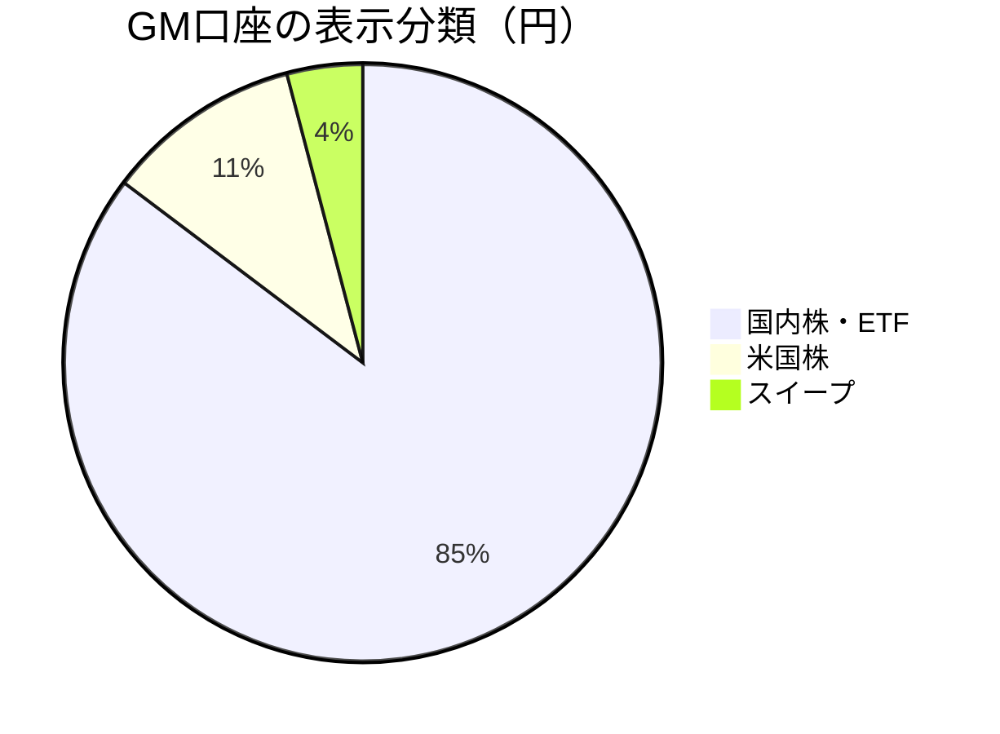
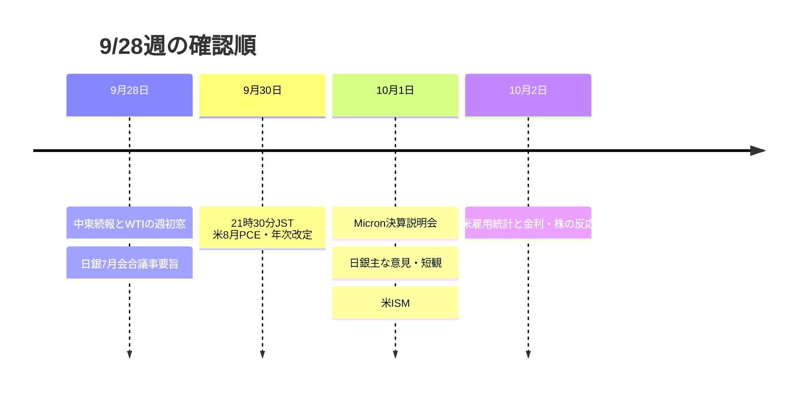

# CFD戦略 — 2026/9/28週

**株の支持を見て参加し、原油と米金利が同時に上がれば防御する。** 週末の報道は9/25終値後の材料。機械snapshotはUSDJPYだけ9/26でSPLIT。

1. Gold CFDは1.0 Lot持越し、4,230基準／報告注文4,220。今週決済0、含み−19.625、全通算評価込み+403.260 pt・Lot。
2. GM口座4,953,356円。前週比+85,048＝保有評価+84,985＋sweep+63。現金63円の原因は未確認。
3. 株はUS100 29,935.5・JP225 66,277〜66,042の支持、WTI 99.303・米10Y 5.228の上抜け有無を最初に確認。

[📊 詳細版（オフラインHTML）](CFD_Strategy-2026-9-28.html)

[[レジーム]] [[Add risk gate]] [[Reduce risk gate]] [[押し目買い]] [[戻り売り]] [[FOMC]] [[日銀政策金利]] [[日銀利上げ]] [[為替介入]] [[US100]] [[USDJPY]] [[BTC]] [[Gold]] [[WTI]] [[US10Y]] [[VIX]]

|市場|最初の観測 → 行動候補|反証・防御|
|---|---|---|
|US100 CFD|29,935.5支持、30,748.9突破後の押しなら参加検討|29,935.5割れ→29,501.3／29,241.4|
|JP225 CFD|66,277〜66,042支持、67,385突破を確認|64,905割れで反発仮説撤回|
|USDJPY|157.521〜158.285戻り失速を売り候補|158.285支持化で撤回。介入実施は未確認|
|WTI cash|99.303を回復・支持化するか、94.849を割るか|原油高＋US10Y>5.228＋株支持割れなら防御|
|Gold市場／CFD|4,288.55→4,319.13回復は市場仮説。保有1 Lotの4,230基準と区別|4,235.02支持割れを市場で確認。報告注文水準4,220を勝手に変更しない|
|BTCUSD|9/26撮影84,153.73、83,795.61支持/85,732抵抗を再確認|進行バーなので9/25確定終値や前週比にしない|

**反対分岐：** 金利が下がるのにUS100が支持を失いVIXが上がるなら、引き締め緩和ではなく景気・利益不安を疑う。X検索の入札統計・介入示唆は原投稿の独立確認ができていないため、執行条件には入れない。

|資料|リンク|
|---|---|
|Rexの当月戦略正本|[distilled-gm-2026-9](../../../../distilled/2026/distilled-gm-2026-9.md)・[[distilled-gm-2026-9]]|
|レビュー／口座／CFD|[review](review.md) / [note](note.md) / [trade_results](trade_results.md) / [portfolio_basis](portfolio_basis.json)|
|数値・画像・出典|[meta](meta.yaml) / [charts](charts.md) / [sources](sources.md)|
|持ち越し・品質|[carry_forward](carry_forward.md) / [quality_gate](quality_gate.md)|
|前週|[9/21週ハブ](../2026-9-18_wk03/CFD戦略-2026-9-21.md)|
