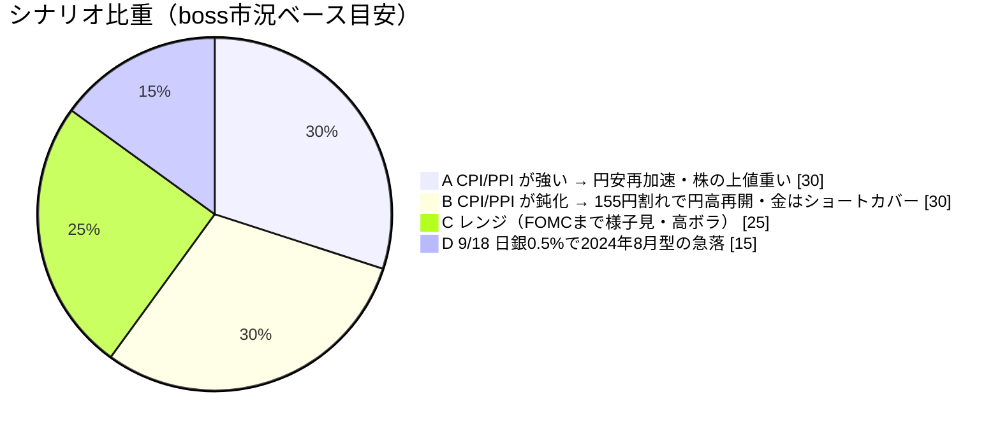
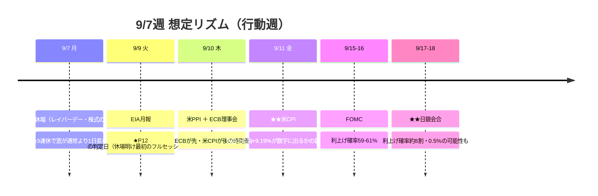

# 📌 CFD戦略ハブ — 9/7週

> [!abstract] 一行サマリー
> ★★**9/4(金)21:30 の NFP が +16.2万人（予想5.5万人の3倍近く）。しかも 7月 -2.3万人→+2.1万人・6月→+3.1万人の二重の上方修正。**「雇用は冷えているが崩壊していない」から**「雇用は底堅い」への解釈転換**が起き、教科書通りの**グッドニュース・イズ・バッドニュース**で **9月FOMC利上げ織り込みが 52-54% → 59-61%**、米金利は全年限で上昇し**株は売られた**（ダウ -0.51% / S&P -0.38% / NASDAQ -0.29%。★小型株ラッセル2000のみ +0.25%）。[[Gold]] **4,431.07（週足 -0.52%）**／[[USDJPY]] **156.195（-2.43%）**／[[WTI]] **91.784（★+9.19%）**。★★**Boss の短期予想（5.5万人超えなら円安に巻き戻る）は的中したが、中期予想の前提「弱い雇用→FRBは動けない」が崩れた。** ★★**そして金が下げた週に通算は +163.26 → +336.53 pt·Lot（+173.27）——価格ではなく執行が作った週。**

> [!warning] [[レジーム]] / ゲート（at a glance）
> - 機械[[レジーム]]: **`Gold Bid`**（equities=flat / volatility=normal / oil=range / **gold=bid** / crypto=strong / **yields=rising**）。★**本週は snapshot の日付が揃っている**（全ペア 9/4）。**wk04 の特例は適用しない**
> - [[Add risk gate]]: **開放**（[[VIX]] 14.51→**14.53** < 18）／ただし骨格は★★**「FRBのタカ派再評価（9/16 FOMC）」と「日銀・GPIF由来の構造的円高圧力（9/17-18 会合）」の綱引き**
> - [[Reduce risk gate]]: **caution**（★**US2Y 4.416%（上昇チャネル上限）上抜け** ／ **[[US10Y]] 4.810 超え** ／ **[[Gold]] 4,400 割れ → 4,280 の4H実体下抜けで撤退** ／ **[[US100]] 29,157 割れ** ／ **[[JP225]] ★9/18 の日銀会合そのもの** ／ **[[USDJPY]] 155.30-155.70 割れ** ／ **[[WTI]] 89.599 割れ** ／ **[[BTC]] 77,588 割れ**）
> - **[[為替介入]]**: `coord_stage` **executed** ／ `imf_ammo` **0** ／ zone=**calm**（156.221）。★**watch_zone を 161.0 → 160.50 に変更**（承認済み・H-5）。⚠️**当面は無関係な水準**だが、**次に近づいたときに機械が黙らないよう先に直した**
> - ★★**ポジションは [[Gold]] 残 0.5 Lot @4,311・ゼロ点 4,015.00**。**確定5件・4勝1敗（勝率80.0%）／実現 +163.00 pt·Lot**。撤退は**週足最終防衛 4,280水準の4H実体下抜け確定**で、★**撤退しても +132.00 が残る**
> - ★★**wk04 で「事前登録に行動が書かれていなかったため、発火しても何も起きなかった」と記録した設計の欠落が閉じた**——`trigger`/`action` を対で登録した2件が**登録どおりに2件とも執行**された
> - ★★**機械側の宿題も4件まとめて閉じた**（§D 決着／是正A・B／NaN 悉皆是正／H-4・窓フィールド）

## 🔗 リンク

| 種別 | リンク |
|---|---|
| 📊 **詳細版（全グラフ・銘柄別・トリガー網羅）** | [CFD_Strategy-2026-9-7.html](./CFD_Strategy-2026-9-7.html) |
| 🧠 Rex戦略データ正本 | [[distilled-gm-2026-9]] |
| 📝 週次一次資料 | [[review]] ・ [[meta]] ・ [[2026-9-4_wk01/note\|note]] ・ [[trade_results]] |
| 📉 **--trade 実測＋データ整合の全記録** | [2026-08-07 〜 2026-09-06](./charts/2026-08-07%20%E3%80%9C%202026-09-06.txt) |
| 📰 市況＋news＋X統合 | [Market conditions -2026-9-4~](./charts/Market%20conditions%20-2026-9-4~.txt) |
| ⏪ 前週ハブ | [[2026-8-28_wk04/CFD戦略-2026-8-31\|wk04 ハブ (8/31週)]] |
| 🌳 システムの年輪 | [2026-06-27 belly_elevated](../../../docs/system/2026-06-27_belly-elevated_rex-curve-error.md) |

## 🎯 今週の要点（3行）

1. **NFP が円高シナリオの土台を揺さぶった — 決着点は 9/10-11 の PPI・CPI** — **+16.2万人＋二重の上方修正**で **9月FOMC利上げ確率 52-54% → 59-61%**。★★**Boss の短期予想は的中したが、中期予想（水曜まで円高）の前提だった「弱い雇用統計→FRBは動けない」が崩れた**。★★**米はスティープ化（2s10s 37.0→41.0bp・長期主導）、日はフラット化（121.9→108.5bp・短期主導）で逆方向**で、**JP2Y +12.7bp が当週で最も動いた金利**。★★**円高は「2年 日米差 -11.3bp の縮小」と同方向、「10年差 +6.1bp の拡大」とは逆方向**＝**当週の円高は2年ゾーンが駆動している**（⚠️n=1・機構は閉じない → **P11**）。★**JH のタカ派効果は1週間で 57-60% → 52-54% へ一部剥落しており、NFPはそれを元の水準に戻しただけ**＝**イベント由来の織り込みは減衰する**。
2. **[[Gold]] は下げたのに、執行で +173.27 pt·Lot 積んだ** — 金は週間 **-0.52%** だが通算は **+163.26 → +336.53 pt·Lot**。効いたのは ①**旧キャンペーンのラダー**（4,380一括の +89.00 に対し **+129.00**）②**9/2 の再エントリー**（再参入しなければ +129.00 止まり・**差 +207.53**）③**NFPの往復**（+10.00、**ゼロ点は 4,232 → 4,222 に低下**）。★★**wk04 で「設計の欠落」と記録した箇所が、`trigger`/`action` を対にした登録により 8/31 @4,460 と 9/1 @4,380 の2件とも執行されて閉じた**。週明けは **4,400 ラインを守れるか**が第一関門で、**4,280 の4H実体下抜け確定で撤退**（★**撤退しても +132.00 が残る**）。
3. **機械側の宿題が4件まとめて閉じ、代わりに新しい故障モードが1件出た** — ★**§D の事前登録が「+5bp以上」の行で決着**（**ΔDFII5 +11.0bp**。★**wk04 で他年限から挟んだ範囲制約 +6〜+14bp が実測で的中**し、**ΔDFII5 = ΔDGS5 + 1.0bp も厳密に成立**）／★**是正A・B**（FRED `DGS2`/`DGS10` で `curve_fred` 新設＋3M系ラベルに用途制限）／★**NaN 悉皆是正＋テスト4本**／★**H-4（per-pair as_of）＋窓の定義フィールド**。⚠️★★**一方で GC=F が同じ 9/4 の終値として1時間以内に 4,429.800 と 4,476.600 の2値を返した**——**日付は正しいのに値が安定しない**という、**H-4 では捕まえられない別の故障モード**（→ **要Boss判断**）。

## 📈 クイックビュー

## ⚠️ 監視トリガー（要点のみ／詳細はHTML）

- ★★**US2Y 4.416%（上昇チャネル上限）** → **終値 4.374% はその 4.2bp 下**。**上抜けで 4.42-4.43%台へ追随／鈍化なら 3.672%（チャネル下限）方向**。**FOMCまでは最もイベントドリブン**
- ★**[[US10Y]] 4.745%（サポート・割れは金利低下トレード）／ 4.810 超えは上昇継続のブレイク → 4.85%**。⚠️**財政プレミアムも絡むため2年債ほど素直にFOMC確率と連動しない**
- ★★**[[Gold]] まず 4,400 を守れるか** → 割れれば **4,367.10 → 4,337.74（200日線近辺）→ 4,282**。★**4,280 の4H実体下抜け確定で撤退**（★**撤退しても +132.00 が残る**／週足終値から **151.07pt = -3.41%**）。戻りは **4,490.32 → 4,519.97 → 4,573.95**
- ⚠️**4,400 圏は3本が10pt以内**（短期波Fibo50 **4,397.93** / 日足波Fibo38.2 **4,409.24** / キリ番 **4,400**）。**上昇が続くと分かれる。★可動の線は再計算してから使う**
- ★**[[US100]] 29,157-29,271（直近サポート）** → **割れは押し目待ちより下値警戒優先** ／ **29,541-29,754 は利食い目線**
- ★★**[[JP225]] 最大の警戒点は 9/17-18 の日銀会合そのもの**（**2024年8月の利上げ後急落＝日経-20%規模の再現リスク**）。**9/18 接近での新規ロング積み増しは避ける**。次のターゲット 65,400-65,800／直近抵抗 67,385
- ★**[[USDJPY]] 戻り売り一次 156.50-157.20・二次 158.10-158.60** ／ **下値 155.30-155.70 割れで 154.40-154.90**。★**9/9(水)引けが P12 の判定日**
- **[[EURUSD]] 1.1660 上抜けか 1.1580 割れのブレイク待ち**。★**9/10 ECB理事会が先、9/11 米CPI が後**という時間差がトリガーになりやすい
- **[[WTI]] 89.599-88.320（サポート）／ 92.404-92.685（抵抗）／ 86.167（中期・割れは中期トレンド転換）**。⚠️★**地政学リスクは方向が非対称**（封鎖・施設攻撃の確証で95-100超え／和平の兆しで86-89まで一気に押し戻し）
- ⚠️**[[BTC]] 77,588 を守っている間は押し目買い目線、割ればポジション縮小**。★**水準そのものが未確定**（本体 79,540.37 vs 出典 $81,000超）
- ★**日本金利 JP2Y 1.848%（直近高値）超えは加速のサイン** ／ **JP10Y 2.90-2.92% が当面のレジスタンス帯**。★**GPIF買いで頭打ちが続くなら日本国債はスティープ化（2年上昇・10年頭打ち）のポジションが妥当**

---

> [!quote] 注記
> 本ノートは **Obsidian索引（ハブ）**。全グラフ・銘柄別・口座画像は [HTML詳細版](./CFD_Strategy-2026-9-7.html)。**Rex正本は [[distilled-gm-2026-9]]**。
> データは 2026-9-4_wk01 確定値（snapshot **2026-09-06** / Boss `wr-2026-9-4`＝**本体 2026-09-05 ＋ Rex追記§A-I 2026-09-05** / **週末終値チャート13枚** / 口座3枚 / `--trade --news` / **X実データ**）。
> ★ **本週は snapshot の日付が揃っている**（全ペア 2026-09-04・BTCのみ週末値）。**機械 US10Y 4.784 = Boss TVC 週足終値 4.784（完全一致）**。⚠️ただし **wk04→wk01 の機械の金利差は 8/27→9/4（6営業日）**で週次ではなく、**週間騰落は Boss 実測が正本**。
> ★★ **§D（実質金利チャネル）の事前登録が閉じた**——**ΔDGS5 +10.0bp / ΔDFII5 +11.0bp / 恒等式 0.00** で、該当行は **「+5bp 以上」**。⚠️**本アーカイブは判定文を書かない**（handoff §5-5。**新規候補の定式化は Boss/Rex 側**）。★**wk04 で他年限から挟んだ範囲制約（ΔDGS5 +5〜+13 → ΔDFII5 +6〜+14、符号は正、分岐は「+5bp以上」）が実測で的中**し、**ΔDFII5 = ΔDGS5 + 1.0bp も 11.0 = 10.0 + 1.0 で厳密に成立**。★**これは代理指標ではない**（恒等式と他年限による範囲の制約）。★**公表タイミング差も再現（n=2）＝構造**なので、**§D 型の検定は「判定日の DGS5/DFII5 は翌週に取る」前提で設計する**。
> ★★ **是正A（front を 2Y へ）の初回で2つ分かった**: ①**別フィードでも週次Δが +4.0bp で完全一致**（FRED 8/28 39.0→9/3 43.0 ／ Boss TVC 8/28 37.0→9/4 41.0。**水準だけ 2.0bp ずれ、傾きは一致**。⚠️n=1）②★★**機械の `change_2s10s_bp_1w` が -4.0bp と符号ごと逆に出た**——**7暦日ルックバックが 8/28 を跨がず 8/27 に落ちた**ためで、**8/28 の1日で 2s10s は -8.0bp フラット化しており、この1日の出入りだけで符号が反転する**。→ ★**Boss の「次の一手」に従い `change_*_bp_1w_window` を実装し、実際に引き算した2日を値の隣に出すようにした**。
> ★★ **NaN → unknown の悉皆是正**（H-3）: **`_num()` で値の入口を1箇所に絞った**ので**新しい判定関数を足しても同じ穴が開かない**。テスト `tests/test_regime_nan.py` 4本・**4/4 pass**。★**本丸は「NaN と None で regime ブロックが完全一致すること」**——**穴が開いた瞬間に落ちる。**
> ★ **H-4（per-pair as_of）**: snapshot 冒頭に **`snapshot_date_integrity`（aligned / SPLIT / missing）**を出す。★**24/7 銘柄は `off_calendar_*` の別枠**——**常時点灯する警告は読まれなくなる**ため。
> ⚠️★★ **新しい故障モード**: **GC=F が同じ 9/4 の終値として1時間以内に 4,429.800 と 4,476.600 の2値を返した**（+46.80 / +1.06%）。**`fast_info.lastPrice` が 4,476.60 と一致**しており、**ライブ気配の上書きか継続限月のロールの可能性**（⚠️**未確定**）。**日付は正しいのに値が安定しないので、H-4 では捕まえられない。** → **要Boss判断**。★**Boss 現物 4,431.07 が正本なので本週の結論は変わらない。**
> ★ **証券口座は当週「売買があった」週**（§10 訂正版）: **9/1 に 513A 売100口@847.2 ／ 200A 売1口・買24口 ＝ 差引 -13,814** で、**スィープの減少額と完全一致**。**513A 実現損 -17,780＝損出しは執行済み**（**6954 は未執行のまま**）。★**8/23以降「自律反発を待つ」として保留していた判断が 9/1 に決着**（839 → 847.2 で +820円）→ ★**「税は急ぐ理由にならない」は結果としても正しかった**。
> ★★ **425A の騰落を「金の週足」と比べてはいけない**——**東証ETFは「東証引け 15:00 JST」時点の原資産を反映**し、**8/28 15:00 はウォーシュ講演（23:00）の前**。**15:00 基準なら -4.90% で実測 -4.48% とほぼ一致**（週足基準の合成 -2.93% とは **1.54pt 合わない**）。**年輪§8(e) の同型。**
> ⚠️ **ベンダー混在**（Rex§I）: XAUUSD=Pepperstone / US2Y・US10Y・JP2Y・JP10Y=TVC / USDJPY=FXCM / WTI=BlackBull / US100=Capital.com / JP225=FOREX.com。**1本の系列に混ぜない**（年輪§8(e)）。
> ⚠️ **ニュース由来とチャート実測を混ぜない**（Rex§E）: 本体の **US2Y +5.3bp** は**発表直後の反応の大きさ**、TVC日足実測 **+3.4bp** は**日足の確定値**。**1.9bp の差はどちらも誤りではない。**
> ⚠️ **X上の数値は未突合**（FOMC 58-60% / 日銀 75%→97% / NFPの内訳が狭い / 高田委員「機動的に」 / ホルムズ通航隻数）。★**日銀確率は Boss 約8割 vs X 最大97% で 17pt の開き。単一の数字で語らない。**
> ⚠️ **未確認の持ち越し**: **2243・1655 の為替ヘッジ**（★価格検証でほぼ確実にヘッジ無し／**目論見書での確定は未実施**）／**5/11 に 1627 を売却した理由**（4週連続）／**8-2/8-3 棄却後の立て直し**。
> 投資助言ではなくGM作戦整理。最終判断はミナト。生成: ClaudeCode / 2026-09-06。
